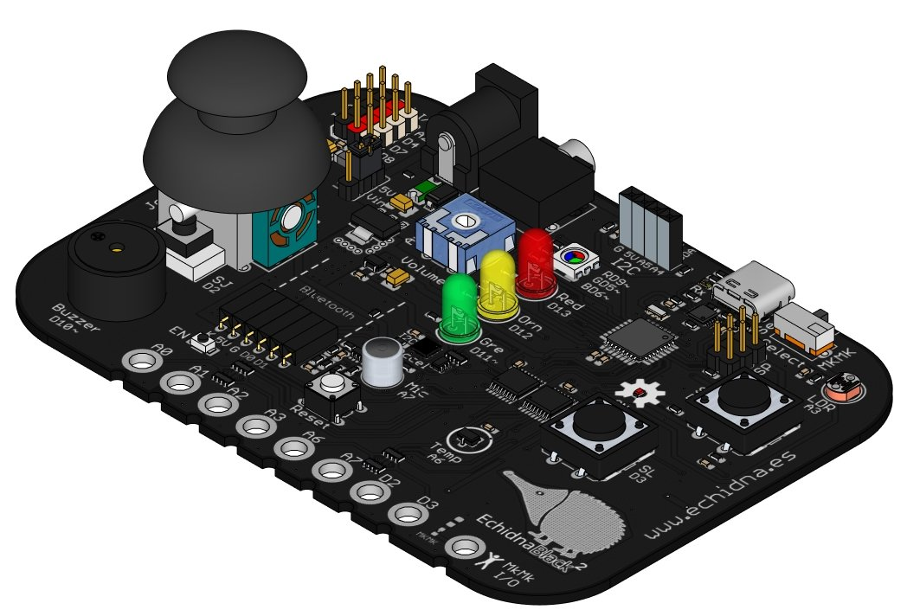
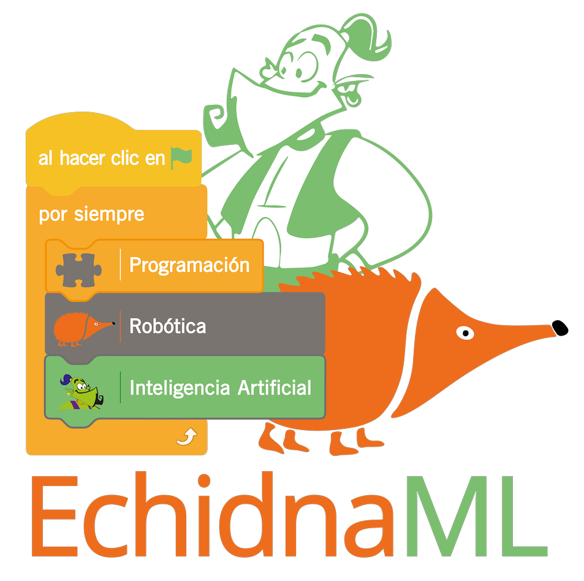

# 1. INTRODUCCIÓN

**EchidnaBlack** (hardware) y **EchidnaML** (software) constituyen un **sistema integrado**: están diseñados para aprender los fundamentos de la **programación**, la **robótica** y la **inteligencia artificial** (IA). Su **objetivo** principal es fomentar el desarrollo del **pensamiento computacional** en estudiantes de niveles básicos y avanzados (Primaria, Secundaria, Bachillerato y F.P.). Además, busca estimular la creatividad a través de la realización de proyectos y actividades prácticas que relacionan el mundo digital y el analógico.

El **sistema** se compone de una **placa** con diversos componentes integrados y un **entorno de programación** diseñado a medida para aprovechar todas sus posibilidades. Además, este conjunto se complementa con **materiales educativos** creados por docentes para facilitar el uso de la placa robótica y el software en el aula.

Esta **guía** ofrece una **introducción** al trabajo con la placa **EchidnaBlack2** y su entorno de programación **EchidnaML**. No se requieren conocimientos de programación previos; sin embargo, se recomienda tener experiencia con el entorno visual de Scratch, ya que facilita la comprensión de la programación por bloques y el conocimiento del entorno.

Para **ampliar** y complementar la **información** ofrecida en esta guía, puede consultar recursos adicionales y material didáctico en la **web** oficial del **proyecto**: [www.echidna.es](https://echidna.es/).
