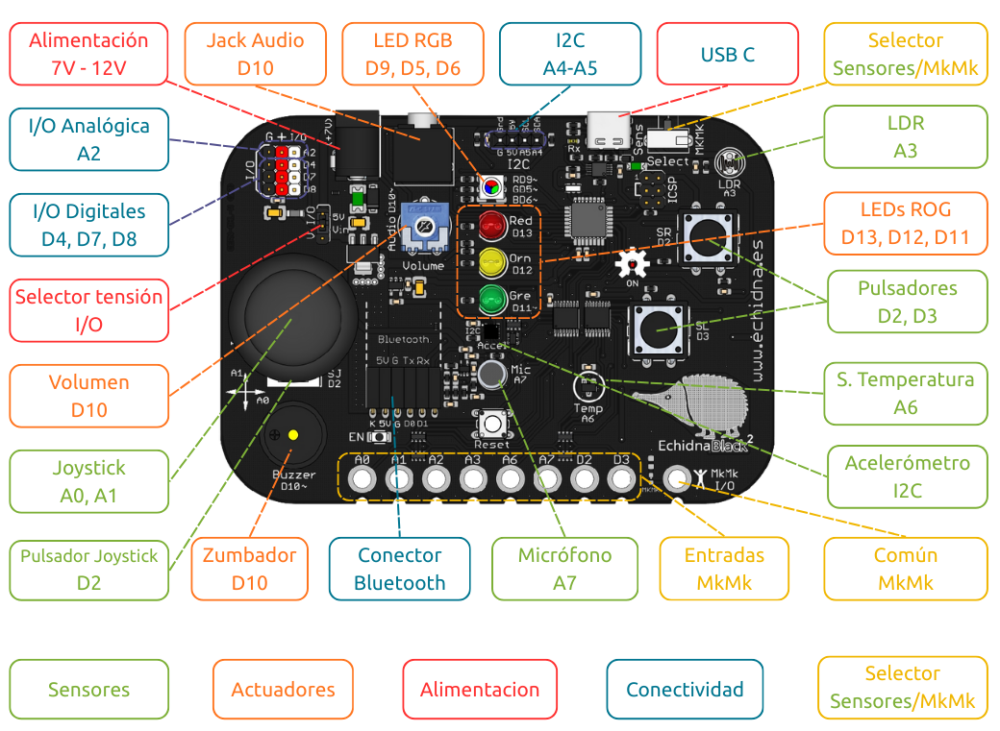
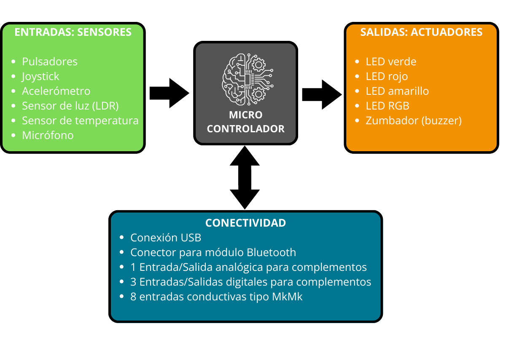

# 2.1 Componentes

La **placa** cuenta con los siguientes **componentes**:

{ width="1000" }

Para conectar la placa EchidnaBlack2 al ordenador es necesario un cable USB-C. En el apartado “[3.3 Puesta en marcha](../03-echidnaml-echidnablocks/04-puesta-en-marcha.md)” lo veremos con detalle.

#### **Clasificación de los componentes de la placa según su función**

Los componentes de la placa pueden clasificarse en cuatro categorías principales según la función que desempeñan dentro del sistema:

**{ width="1001" }**

**Entradas** (Sensores): son los elementos que capturan información del entorno (variables como temperatura, luz, sonido, gravedad, etc.) y la traducen en datos que el sistema puede procesar.

**Microcontrolador** (Cerebro del Sistema): es el procesador central de la placa. Su función es recibir los datos de las entradas, ejecutar las instrucciones del programa y enviar las órdenes a las salidas.

**Salidas** (Actuadores): son los elementos encargados de producir una acción o respuesta física basada en las órdenes del microcontrolador. En esta placa, esto se manifiesta principalmente en forma de luz (LEDs) y sonido (Buzzer).

**Conectividad**: son los componentes que facilitan la comunicación de la placa, permitiendo la interacción con otros dispositivos (como el ordenador) o la conexión de componentes externos (sensores y actuadores adicionales).
