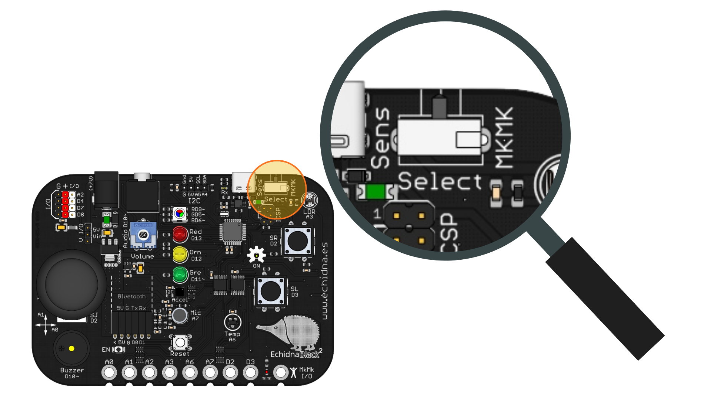
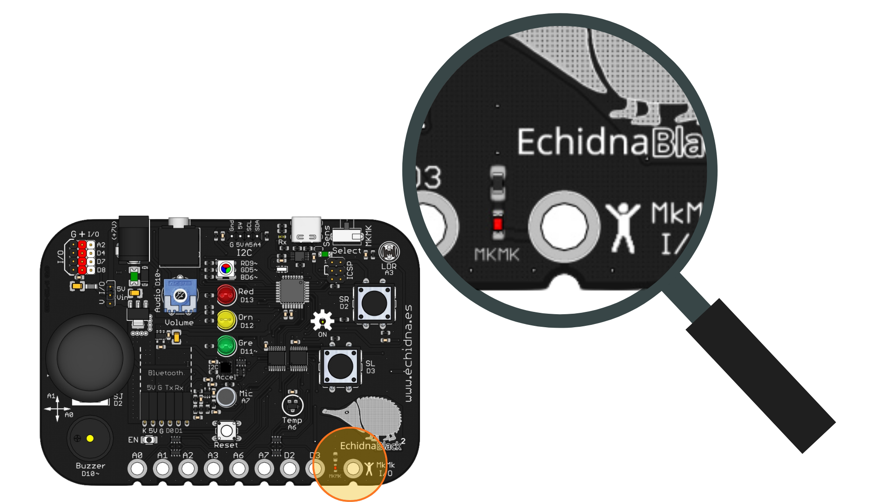

# 2.2 Modos de funcionamiento

La placa EchidnaBlack2 dispone de dos modos de funcionamiento, el **Modo Sensores** y el **Modo MkMk**. Mediante un conmutador podemos seleccionar el modo en el que queremos trabajar.

{ width="320" }

{ width="320" }

**¡ATENCIÓN!** Un testigo luminoso rojo nos indica cuando estamos en modo MkMk.

#### **Modo Sensores**

Recoge la lectura de todos los sensores integrados (pulsadores SR y SL, joystick, sensor de temperatura, micrófono, acelerómetro XYZ) y de todas las conexiones I/O, incluidas las I2C.

#### **Modo MkMk**

Nos da acceso a las 8 entradas conductivas tipo Makey Makey (MkMk) y al resto de las entradas no usadas en este modo.

En ambos modos tenemos disponibles todos los actuadores.
