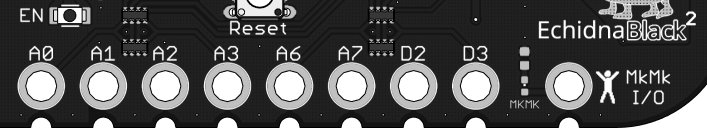

# 2.3 Entradas MkMk

Las **entradas** tipo **Makey Makey** (MkMk) se **habilitan** al desplazar el **conmutador** de modos de funcionamiento hacia la derecha. Un **LED rojo** se ilumina para avisar al usuario cuando el modo MkMk está **activo**.

Las entradas **MkMk** son capaces de **detectar** **conductividad** eléctrica a través de una amplia variedad de materiales. La detección de la señal se produce cuando el circuito se cierra al tocar, de forma simultánea, el elemento conductor conectado a la entrada y el conector MkMk (o la superficie del símbolo Echidna) de la placa.

{ width="707" }

La placa dispone de **8 entradas MkMk**: A0, A1, A2, A3, A6, A7, D2, D3.

Este modo **permite** crear **proyectos** que unen el **mundo** **físico** más cercano con el virtual **digital** que se desarrolla en el ordenador de forma muy sencilla y manipulativa. Como por ejemplo mediante la creación de pulsadores hechos con plastilina conductiva, frutas, papel de aluminio o agua, añadiendo un componente lúdico, creativo y de exploración a los proyectos.
