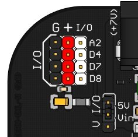

# 2.4 Pines de entrada/salida

{ width="200" }

Los **pines** de **entrada/salida** (I/O) son **conexiones** que nos permiten conectar dispositivos adicionales a la placa, actuando como entradas (sensores) o salidas (actuadores).

- Cuando funcionan como **entrada** reciben información de sensores externos.
- Cuando funcionan como **salida**, envían señales desde la placa para controlar actuadores externos.

La placa cuenta con **tres pines digitales** de entrada/salida  (D4, D7, D8) y **uno analógico** (A2), a los que podemos conectar una gran variedad de componentes, como servomotores, sensores de distancia infrarrojos, sensores de humedad de suelo, etc.

Cada pin de entrada/salida cuenta con una conexión a 0 V (G), 5 V (+), y el pin de señal (I/O).

#### **Selector de alimentación**

Junto a la zona de pines de entrada/salida se encuentra un selector que permite elegir el origen de la energía mediante la posición de un jumper:

**Posición 5V**

La corriente proviene del regulador de tensión interno de la placa (o del puerto USB). Es la opción ideal para alimentar sensores y componentes estándar de bajo consumo.

**Limitación de Corriente:** El consumo total de los componentes externos conectados a la línea de 5V con un límite absoluto 500 mA, se recomienda no superar los 300 mA Exceder este límite puede provocar el apagado por protección o sobrecargar el regulador interno.

**Posición Vin**

La alimentación se toma directamente de la fuente externa conectada a la toma de corriente (jack). Esta opción es la recomendable al conectar actuadores de mayor consumo, como servomotores o motores DC, para no saturar la línea de 5V de la placa.