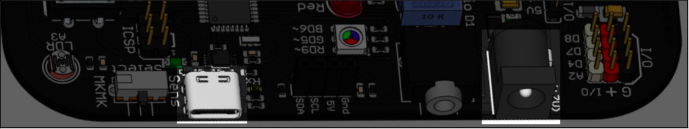

# 2.5 Alimentación

#### ****

#### **Alimentación por USB-C**

La **alimentación** a través de **USB**-C es la forma más **recomendable** para la **mayoría** de los **usos**.

Esta es la forma más sencilla, y común de usar la placa, mediante un cable USB-C conectado a un ordenador. La placa recibe una tensión de 5 V y suficiente energía para las funciones básicas.

#### **Alimentación por Jack**

La usamos cuando queremos conectar elementos con mucha **potencia**, como varios servomotores, o para proyectos autónomos. Si queremos que funcione EchidnaML debemos conectar también por cable USB para que se comuniquen el microcontrolador con el ordenador.
