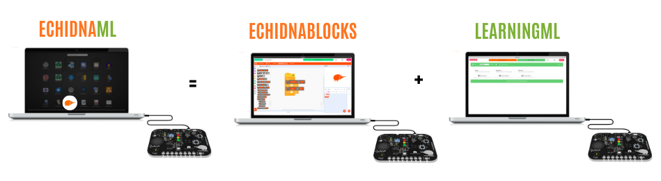

# 3.1 EchidnaML

**EchidnaML** es el ecosistema de software oficial **diseñado** para **programar** las **placas** **Echidna**. Se trata de una aplicación de escritorio que unifica tres áreas clave en una sola interfaz: programación por bloques, robótica e Inteligencia Artificial.

Este entorno integra dos potentes herramientas que trabajan de forma conjunta:

- **EchidnaBlocks**: Una versión personalizada de Scratch que añade bloques específicos para el control del hardware (sensores y actuadores) y la interacción con modelos de IA.
- **LearningML**: Un módulo especializado en aprendizaje automático (machine learning) que permite crear, entrenar y desplegar modelos de IA sin salir de la aplicación.

{ width="949" }

**Ventajas del Sistema Integrado:**

- **Plug and play**: reconoce la placa y permite empezar a trabajar con ella directamente
- **Todo en uno:** No es necesario cambiar de programa para pasar de la programación robótica a la creación de modelos de IA.
- **Continuidad**: Permite usar los modelos generados en LearningML directamente dentro de los proyectos de la versión de Scratch en EchidnaBlocks.
- **Seguridad**: Al ser una aplicación de escritorio, facilita el trabajo sin conexión y garantiza un entorno controlado para el aula.

#### Descargar el programa

Para empezar a trabajar con EchidnaML, es necesario [descargar el programa](https://echidna.es/a-programar/echidnaml/) desde la página web de Echidna Educación.

#### **Detección de la placa**

El **programa** **detecta** **automáticamente** la **placa** y la versión de la misma que estamos utilizando EchidnaBlack o EchidnaBlack2. Para ello debemos conectar la placa antes de abrir EchidnaML.

**Trabajo sin la placa conectada:**

EchidnaML permite que trabajemos sin conectar la placa. Sin la placa conectada podemos:

1.  Usar LearningML para construir modelos.
2.  Usar el clon de Scratch.
3.  Programar un programa de robótica y guardarlo en el equipo para cuando conectemos la placa.

**Reconectar la placa con el programa abierto:**

En el caso de que abramos el programa sin la placa conectada, podemos conectar la placa posteriormente. Para que el programa EchidnaML detecte la placa tenemos que pulsar en el icono de USB.

Si reconectas la placa una vez abierto EchidnaML perderás todo el trabajo, por lo que debes guardarlo antes para poder recuperarlo luego.
