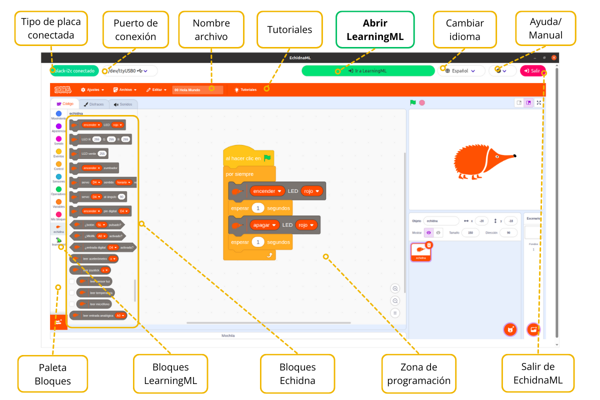
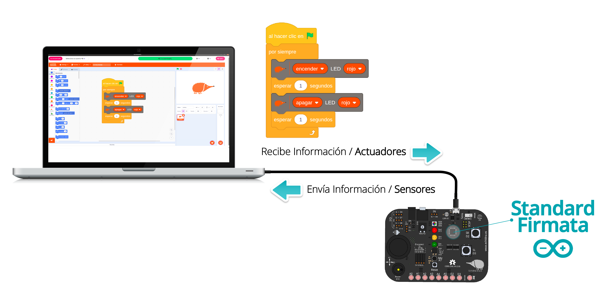
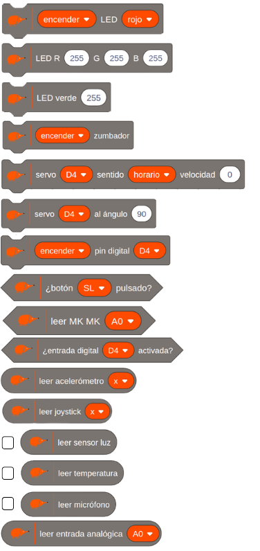
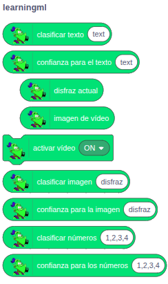

# 3.2 EchidnaBlocks

**EchidnaBlocks** es una versión de **Scratch** que incorpora **bloques** específicos para controlar la placa **EchidnaBlack2** y para integrar modelos de **machine learning** mediante LearningML.

#### Entorno de programación

{ width="1001" }

#### **Comunicación placa-programa**

**EchidnaBlocks** se **comunica** con el **microcontrolador** a través del **puerto** **serie**, mediante el cable USB. La placa envía información sobre el estado de los sensores y el programa que realizamos en EchidnaBlocks lo procesa y devuelve información sobre el estado de los actuadores de la placa.

{ width="799" }

#### **Bloques de programación de la placa**

{ width="376" }

**EchidnaBlocks** ha añadido los siguientes **bloques** de **programación** a Scratch que permiten **controlar** el funcionamiento de la **placa**. Estos bloques permiten tanto leer la información de los sensores como enviar señales para controlar los actuadores de forma sencilla.

Si observamos los **bloques** por su **forma**, podemos distinguir 3 tipos de bloques: rectangulares, trapezoidales y redondeados.

**Rectangulares**:

Son bloques dedicados a programar los actuadores (LED, Zumbador, servo, etc.).

**Trapezoidales**:

Son bloques destinados a leer sensores y entradas digitales, cuya lectura devuelve un *true* (1) o *false* (0).

**Redondeados**:

Son bloques destinados a leer sensores, entradas analógicas, estos bloques devuelven el valor del sensor.

Hay tres de ellos, luz, temperatura y micrófono, que permiten activar la **casilla** de **verificación** permitiendo visualizar el valor registrado.

No te preocupes por lo que hace cada uno de los bloques ahora; lo veremos en el siguiente apartado a través de ejemplos.

#### **Bloques de programación de LearningML**

{ width="244" }

**EchidnaML** integra **LearningML**, una **plataforma** **educativa** diseñada para la enseñanza de los **fundamentos** del **machine learning** (aprendizaje automático). Esto nos permite incorporar Inteligencia Artificial a nuestros proyectos de robótica.

EchidnaBlocks incorpora bloques específicos de machine learning (ML) que permiten construir aplicaciones de inteligencia artificial (IA) capaces de reconocer imágenes, números y textos escritos en lenguaje natural.

Estos bloques, que se encuentran en la sección LearningML, pueden combinarse con los bloques de control de las placas Echidna y con las funcionalidades estándar de Scratch.

De esta forma, los estudiantes pueden unir el mundo de la IA con la robótica educativa para crear proyectos avanzados.

Para usar los bloques de machine learning, primero debes crear un modelo de reconocimiento de imágenes o textos. Pero eso lo contaremos en el apartado 5 de este manual que está dedicado a LearningML.
