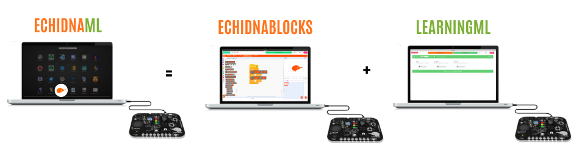
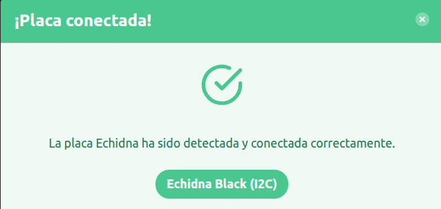
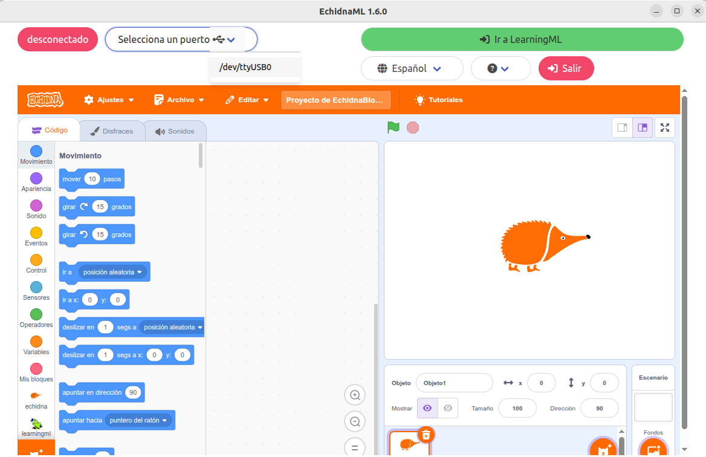

# 3.2.1 Detección de la placa

El **programa** **detecta** **automáticamente** la **placa** y la versión de la misma que estamos utilizando: EchidnaBlack o EchidnaBlack2. Para ello debemos conectar la placa antes de abrir EchidnaML.

{ width="949" }

El programa detecta automáticamente la placa y nos muestra el mensaje:

{ width="319" }

**Trabajo sin la placa conectada:**

EchidnaML permite que trabajemos sin conectar la placa. Sin la placa conectada podemos:

1.  Usar LearningML para construir modelos.
2.  Usar el clon de Scratch.
3.  Programar un programa de robótica y guardarlo en el equipo para cuando conectemos la placa.

**Reconectar la placa con el programa abierto:**

En el caso de que abramos el programa sin la placa conectada, podemos conectar la placa posteriormente. Para que el programa EchidnaML detecte la placa tenemos que pulsar en el icono de USB.

**¡ATENCIÓN!** Si reconectas la placa una vez abierto EchidnaML perderás todo el trabajo, por lo que debes guardarlo antes para poder recuperarlo luego.
