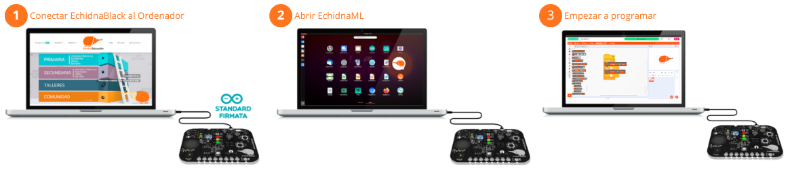
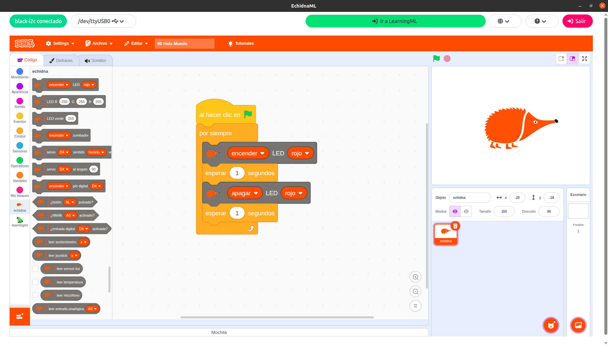
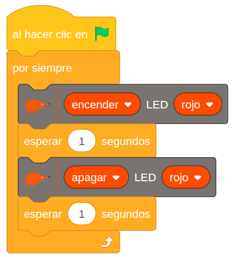
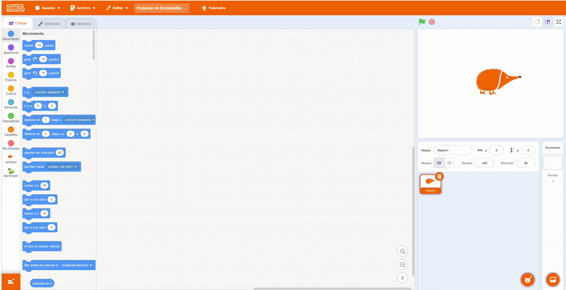

# 3.2.3 Puesta en marcha

Comenzar a trabajar con el entorno Echidna es muy sencillo, ya que la placa cuenta con sensores y actuadores integrados y el software la detecta automáticamente permitiendo que podamos empezar a programar directamente.

En este gráfico podemos ver los **pasos** para **comenzar** a usar **EchidnaML** y **EchidnaBlack**:

{ width="1002" }

**1- Conecta la placa Echidna al ordenador mediante el cable USB-C**

Antes de abrir el programa EchidnaML conecta la placa al ordenador mediante el cable USB-C.

Las placas Echidna tienen cargado de fábrica el programa StandardFirmata, necesario para la comunicación con el ordenador a través del puerto serie (USB).

**2- Abre el programa EchidnaML**

En tu ordenador clica en el icono de EchidnaML para abrir el programa. Previamente debes haber instalado el programa.

**3- ¡Empieza a programar!: Hola, Mundo con EchidnaBlocks!**

Al iniciar EchidnaML, este se conecta automáticamente con la placa. Si el programa no detecta la placa, visita el apartado 6.2 de este manual donde explicamos cómo cargar el programa StandardFirmata.

Al combinar los nuevos bloques específicos de la placa Echidna con los bloques clásicos de Scratch, podemos programar dispositivos físicos de manera sencilla.

{ width="800" }

Como primer ejercicio de iniciación, vamos a crear el "**Hola, Mundo!**" de la robótica: un LED que parpadea de forma intermitente.

=== "Programa"

    { width="350" }

=== "Paso a paso"

    { .solo-web }

**Lógica del programa:**

El programa empieza con el bloque **`al hacer clic en`** (bandera verde): todo lo que coloquemos debajo se ejecutará cuando pulsemos la bandera verde en EchidnaML.

El bloque **`por siempre`** crea un ciclo infinito que ejecuta los pasos en orden, de arriba a abajo:

1. **`encender LED rojo`**: Envía la señal para encender el LED.
2. **`esperar 1 segundos`**: Mantiene el LED encendido durante un segundo.
3. **`apagar LED rojo`**: Envía la señal para apagar el LED.
4. **`esperar 1 segundos`**: Mantiene el LED apagado durante un segundo antes de volver al paso 1.
