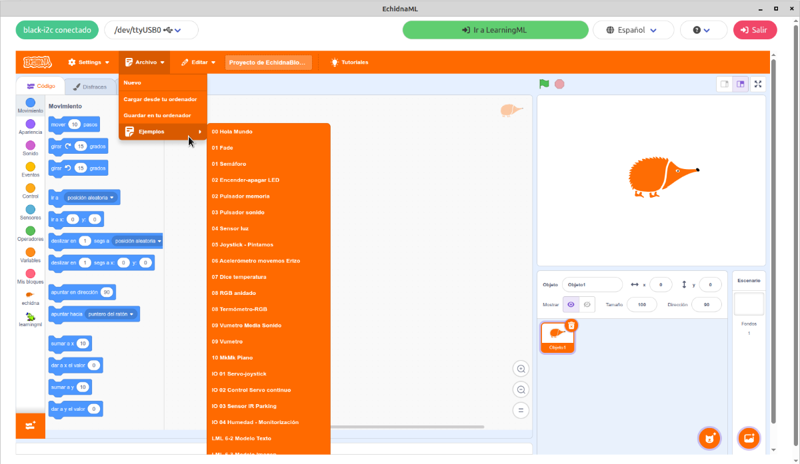

# 3.2.1 Menú Archivo

En el **menú** **Archivo** encontramos:

- Nuevo
- Cargar desde tu ordenador
- Guardar en tu ordenador
- Ejemplos

#### 

#### Nuevo

Si quieres empezar un nuevo proyecto.

#### Guardar en tu ordenador

EchidnaBlocks es un programa de Escritorio, por lo que si quieres guardar tus proyectos debes descargarlos y almacenarlos en tu ordenador. Para ello debes pulsar en Archivo→ Guardar en tu ordenador y almacenarlo en la carpeta que elijas.

#### Cargar desde tu ordenador

Para **recuperar** un proyecto debes pulsar en Archivo→ Cargar desde tu ordenador y buscar el archivo en la carpeta donde lo guardaste.

Los proyectos se almacenan en **formato sb3**, que es el mismo tipo de ficheros que **Scratch**.

EchidnaBlocks es **compatible** con los **proyectos** realizados en **Scratch**, por lo que puedes descargar cualquier proyecto realizado en Scratch y cargarlo en EchidnaBlocks dotándolos de interactividad a través de los sensores de la placa.

#### Ejemplos

En este submenú puedes encontrar todos los **ejemplos** que desarrollamos a continuación en el apartado 5 del **manual**.

En Echidna creemos que una de las mejores formas de **aprender** es a partir de **ejemplos** por lo que os facilitamos estos programas para que podáis probarlos, estudiarlos y modificarlos, una de las esencias del software libre.
