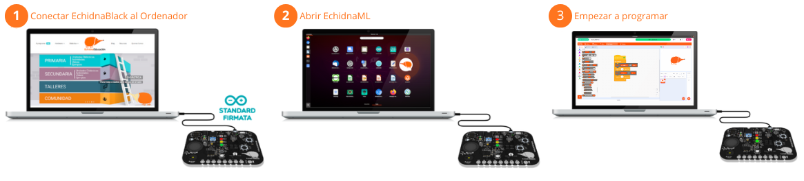
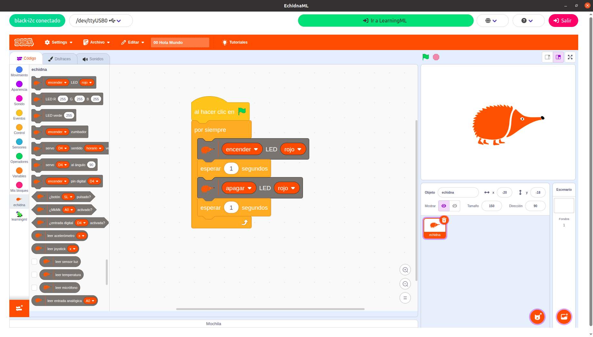
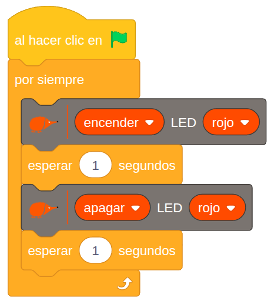

# 3.3 Puesta en marcha

Comenzar a trabajar con el entorno Echidna es muy sencillo, ya que la placa cuenta con sensores y actuadores integrados y el software la detecta automáticamente permitiendo que podamos empezar a programar directamente.

En este gráfico podemos ver los **pasos** para **comenzar** a usar **EchidnaML** y **EchidnaBlack**:

{ width="1002" }

**1- Conecta la placa Echidna al ordenador mediante el cable USB C**

Antes de abrir el programa EchidnaML conecta la placa al ordenador mediante el cable USB C.

Las placas Echidna tienen cargado de fábrica el programa StandardFirmata, necesario para la comunicación con el ordenador a través del puerto serie (USB).

**2- Abre el programa EchidnaML**

En tu ordenador clica en el icono de EchidnaML para abrir el programa. Previamente debes haber instalado el programa.

**3- ¡Empieza a programar!: Hola, Mundo con EchidnaBlocks!**

Al iniciar el EchidnaML, este se conecta automáticamente con la placa. Si el programa no detecta la placa, visita el apartado 6.2 de este manual donde explicamos cómo cargar el programa StandardFirmata.

Al combinar los nuevos bloques específicos de la placa Echidna con los bloques clásicos de Scratch, podemos programar dispositivos físicos de manera sencilla.

{ width="800" }

Como primer ejercicio de iniciación, vamos a crear el "**Hola, Mundo!**" de la robótica: un LED que parpadea de forma intermitente.

**Lógica del Programa:**

Este programa utiliza un bucle continuo para ejecutar la siguiente secuencia lógica, creando un parpadeo constante en el LED Rojo:

1.  Activación: Se enciende el LED Rojo.
2.  Espera: Se detiene la ejecución del programa durante un segundo.
3.  Desactivación: Se apaga el LED Rojo.
4.  Espera: Se detiene la ejecución del programa durante un segundo antes de volver a empezar el ciclo.

{ width="350" }
