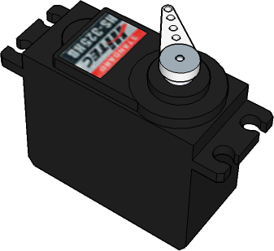
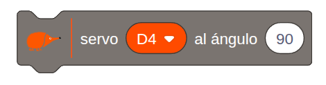
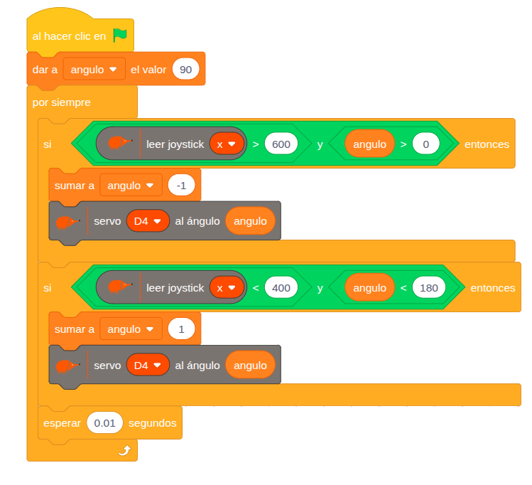

# 4.2.1 Servomotor de posición: Control posición servo con joystick

## COMPONENTE:

{ width="200" }

Son **motores** de corriente continua con una reductora y electrónica de control que permiten **posicionarlo** en un **ángulo** entre **0** y **180º**.

Para conectarlo usamos los **pines I/O** de entrada-salida**: D4, D7, D8, A2**.

{ width="320" }

Presta atención al conectar los cables: Vcc, GND y señal, que están indicados por los colores rojo, negro y amarillo.

En caso de que vayas a conectar varios servomotores usa alimentación externa y coloca el selector de alimentación en la posición Vin. Ver apartado 2.4. Pines de entrada- salida.

## BLOQUE DE PROGRAMACIÓN:

Para **controlar** el **servomotor** de **posición** podemos usar el siguiente **bloque**:

{ width="287" }

En el **bloque** podemos seleccionar el **pin** al que conectamos nuestro servomotor y el **ángulo** de **giro**.

**Pines**: podemos seleccionar los pines; **D4, D7, D8 y A2**.

**Ángulo** de giro: **0-180**º.

## EJEMPLO: Control de posición de servo con joystick

Este ejemplo muestra cómo **controlar** la **posición** **angular** de un **servomotor** de posición utilizando el **eje x** del **joystick** como entrada. La variable *ángulo* almacena la posición deseada y es la que determina la posición del motor.

{ width="600" }

**Lógica de programación:**

El programa ajusta el valor de la variable ángulo mediante dos condiciones:

SI el valor del joystick x es mayor de 600 y el ángulo menor de 180º:

   --\> Sumamos uno al valor de la variable ángulo.

   --\> Ajustamos la posición del servo.

SI el valor del joystick x es menor de 600 y el ángulo mayor de 0º:

   --\> Restamos uno al valor de la variable ángulo.

   --\> Ajustamos la posición del servo.

Introducimos un tiempo de espera de 0,1 s que evita que el servo esté continuamente reposicionándose, lo cual podría llevar a un funcionamiento inestable.
