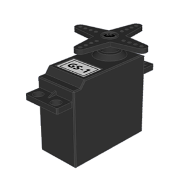
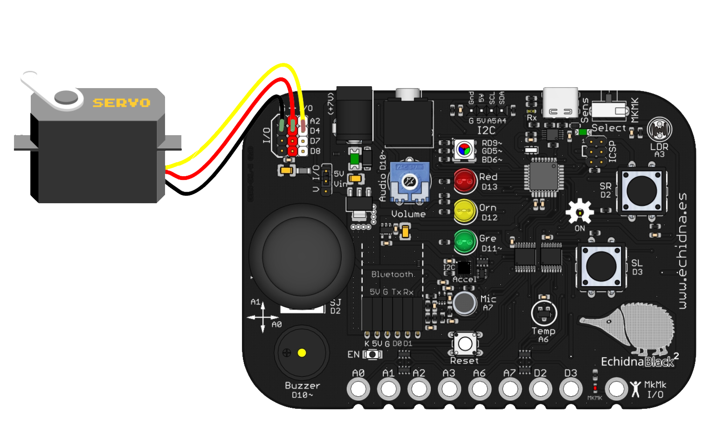
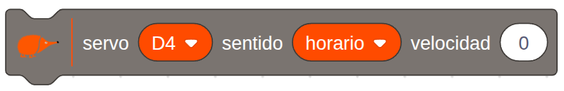
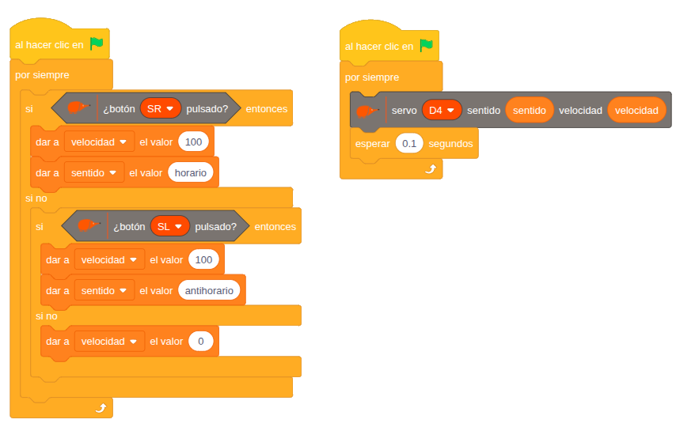

# 4.2.2 Servomotor de rotación continua: Control de sentido de giro con pulsadores

## COMPONENTE:

{ width="200" }

Son **motores** de corriente continua con una reductora y electrónica de control que permiten **controlar** el **sentido** de **giro** del motor. Estos motores además permiten **ajustar** una pequeña variación en su **velocidad**.

Para conectarlo usamos los **pines I/O** de **entrada-salida** (D4, D7, D8, A2).

{ width="320" }

Presta atención al conectar los cables: Vcc, GND y señal, que están indicados por los colores rojo, negro y amarillo.

En caso de que vayas a conectar varios servomotores usa alimentación externa y coloca el selector de alimentación en la posición Vin. Ver apartado 2.4.

## BLOQUE DE PROGRAMACIÓN:

Para **controlar** el **servomotor** de **rotación** **continua** podemos usar el siguiente **bloque**:

{ width="462" }

En el **bloque** podemos **seleccionar** el **pin** al que conectamos nuestro servo, el **sentido de giro** y la **velocidad**.

**Pines**: podemos seleccionar los pines; D4, D7, D8 y A2.

**Sentido de giro**: horario/ antihorario

**Velocidad**: 0-100%

## EJEMPLO: Control de sentido de giro de servomotor continuo con pulsadores

Este **ejemplo** ilustra cómo **controlar** el **sentido de giro** de un servomotor continuo (360 grados) utilizando **dos pulsadores** como entradas.

Si pulsamos el **botón** **SR** el motor gira en sentido **horario**. Si pulsamos el botón **SL** el motor gira en sentido **antihorario**. Si **no** **presionamos** ninguno de los dos pulsadores, el motor se **para**.

{ width="854" }

**Hilo de control:**

El programa evalúa el estado de los pulsadores para determinar la dirección del giro o la detención del servomotor.

Creamos las **variables**:

- **velocidad**: para controlar encendido (100)/ apagado (0) del motor.
- **sentido**: para controlar el sentido de giro, horario/antihorario, del motor.

**Giro Horario:**

SI el pulsador SR (Derecho) está presionado:

   --\> La variable sentido= horario (indica que el giro será en sentido horario).

   --\> La variable velocidad=100.

**Giro Antihorario:**

SI NO:

   SI el pulsador SR (Derecho) está presionado:  
   --\> La variable sentido= antihorario (indica que el giro será en sentido anti-horario).  
   --\> La variable velocidad=100.

**Detención:**

   SI NO (es decir, si ninguno de los dos pulsadores está presionado):  
      --\> La variable velocidad=0.

**Hilo de actuación:**

EL servomotor continuo gira en el sentido que le indica la variable sentido y a la velocidad indicada por la variable velocidad.

Introducimos un tiempo de espera de 0,1 s que evita que el servomotor esté continuamente reposicionándose, lo cual podría llevar a un funcionamiento inestable.
