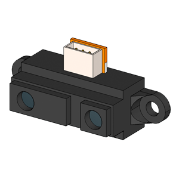
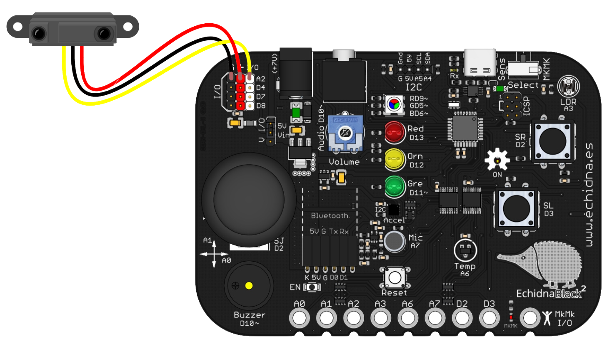
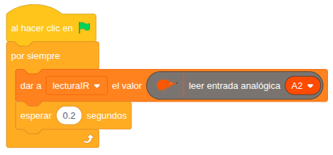
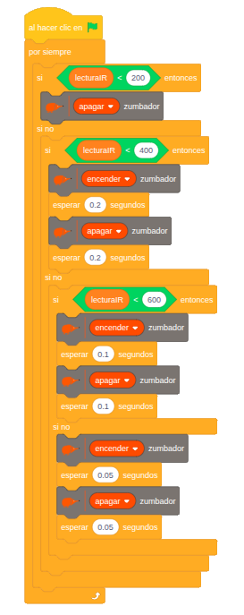

# 4.2.3 Sensor de distancia de infrarrojos: Sistema de asistencia al estacionamiento

## COMPONENTE:

<div class="img-text-row" markdown="1">
{ width="200" }

Es un **sensor** de **distancia** que proporciona una tensión según la cantidad de infrarrojo que rebota en una superficie.
</div>

**Salida Inversamente Proporcional y No Lineal:** el **valor** de salida es **inversamente** **proporcional** a la **distancia** al objeto. Es decir, el valor aumenta cuanto más se acerca el objeto. Además, la relación entre el valor de salida y la distancia no es lineal, por lo que requiere calibración o el uso de tablas para obtener una distancia precisa.

**Rango de medida:** El rango efectivo de medición varía significativamente según el modelo específico del sensor utilizado.

**Susceptibilidad a la luz:** La precisión del sensor puede verse afectada por la presencia de luz ambiente intensa o fuentes de infrarrojos externas.

<div class="img-text-row" markdown="1">
{ width="320" }

**Conexión:** Se conecta directamente a **5V, GND y A2.**
</div>

## BLOQUE DE PROGRAMACIÓN:

Utilizaremos el bloque genérico, leer entrada analógica, seleccionando la entrada A2:

{ width="387" }

**Valores**: el rango de valores de la entrada analógica es 0-1023.

## EJEMPLO: Sistema de asistencia al estacionamiento

Este **ejemplo** simula un **sistema** de **ayuda** al **estacionamiento**.

El **sensor de distancia IR** conectado en el pin de entrada/salida (I/O A2) **mide** continuamente la **distancia** a un objeto. La funcionalidad del programa es modular la **frecuencia** del **zumbador** en función de esta distancia.

**1º Medir valores de distancia:**

El primer paso es medir los valores de distancia y almacenarlos en la variable *lecturaIR*, que utilizaremos para monitorizar y mostrar el valor del sensor.

{ width="466" }

Para ello podemos usar este programa que lee continuamente el valor del sensor conectado al pin analógico A2 y se guarda en la variable *lecturaIR*. Cada medida se realiza con un intervalo de 0,2 segundos para estabilizar la lectura.

Podemos activar la casilla de verificación de la variable para ver el valor registrado.

**2º Selección de umbrales:**

El siguiente paso será seleccionar tres umbrales diferentes poniendo un obstáculo frente al sensor a las tres distancias que queramos definir. En este caso usamos estos tres valores:

- **Distancia Pequeña**: 200
- **Distancia Muy Pequeña**: 400
- **Distancia Mínima**: 600

**3º Programa**

Tenemos dos hilos de ejecución:

{ width="273" }

**Hilo 1 de adquisición de datos:**

Medimos el valor del sensor y lo almacenamos en la variable lecturaIR. Tal como hemos visto en el paso 1º Medir valores de distancia.

**Hilo 2 Lógica de programación:**

**Zona Segura:**

```
SI la distancia es menor de 200:
    --> El zumbador permanece apagado.
```

**Zona de Advertencia:**

```
SI NO:
    SI la variable lecturaIR es menor de 400 (200 ≤ distancia < 400):
        --> Los pitidos se encienden y apagan con pausas de 0,2 segundos.
```

**Zona de Peligro Alto:**

```
SI NO:
    SI la variable lecturaIR es menor de 600 (400 ≤ distancia < 600):
        --> El zumbador se enciende y apaga cada 0,1 segundos, produciendo un ritmo más rápido.
```

**Zona Crítica** (Colisión Inminente):

```
SI NO (si ninguna de las condiciones anteriores se cumple, es decir, la variable lecturaIR es mayor o igual a 600):
    --> El zumbador emite pitidos muy rápidos, encendiéndose y apagándose cada 0,05 segundos.
```

Todo este proceso se repite mediante un bucle por siempre, ajustando el sonido según lo cerca o lejos que esté el objeto.
