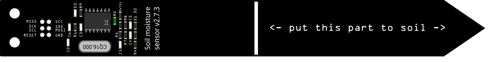
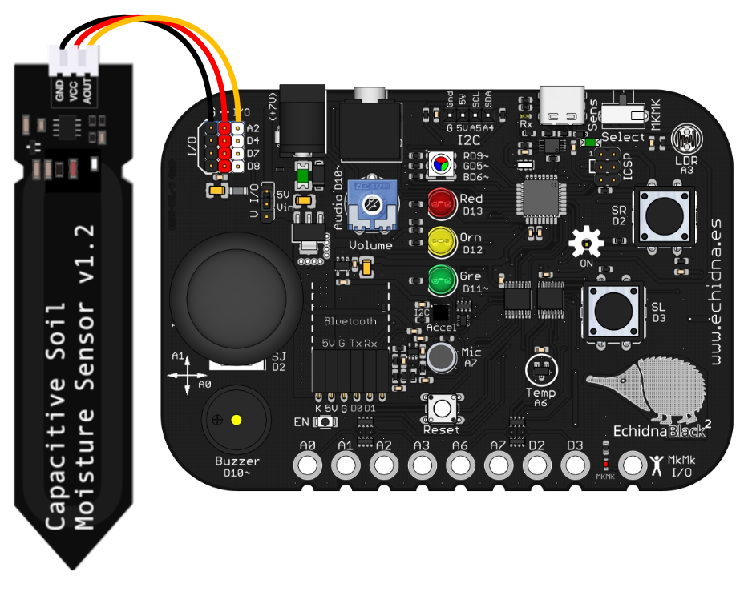
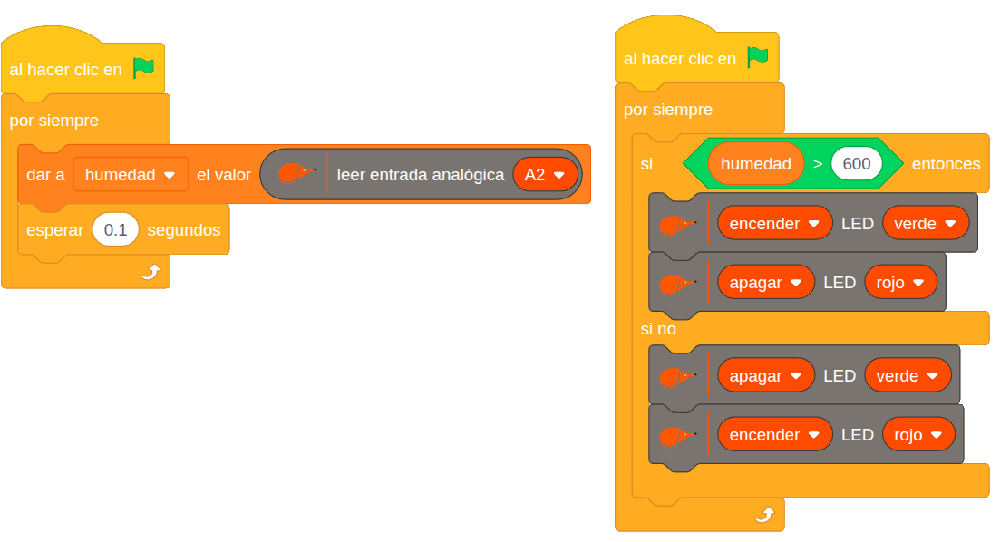

# 4.2.4 Sensor de humedad del suelo: Monitorización de riego

## COMPONENTE:

El **sensor** de **humedad** del suelo permite **medir** la **cantidad** de **agua** en la **tierra**.

Tiene dos componentes principales: los electrodos, que se introducen en la tierra, y un circuito electrónico que convierte la humedad detectada en una señal eléctrica. Cuando el suelo contiene más agua, la conductividad entre los electrodos aumenta y, por tanto, el sensor devuelve un voltaje mayor; cuando el suelo está seco, la conductividad disminuye y el voltaje es menor.

{ width="172" }

{ width="280" }

**Conexión:** Se conecta directamente a 5V, GND y A2.

## BLOQUE DE PROGRAMACIÓN:

Utilizaremos el **bloque** **genérico**, **leer entrada analógica**, seleccionando la entrada **A2**.

{ width="387" }

**Valores**: el rango de valores de la entrada analógica es 0-1023.

## EJEMPLO: Monitorización de riego

En el **ejemplo** vemos cómo hacer un sistema que nos **indique** cuando hay que **regar** una **planta**.

- Si la **humedad** es **adecuada** lo indicamos con el **LED verde**.
- Si la **humedad** es **baja** y la planta necesita ser regada lo indicamos con el **LED rojo**.

{ width="1000" }

Lo primero es leer y almacenar los valores que proporciona el sensor de humedad en función del grado de humedad de la tierra.

En función de estos valores fijamos el umbral (en este caso 600) que determina que si la humedad es inferior se enciende el LED rojo y si es mayor se encienda el LED verde.
