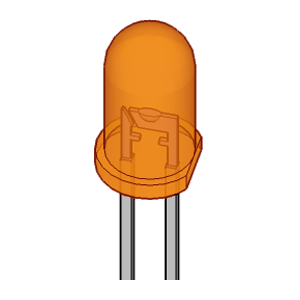
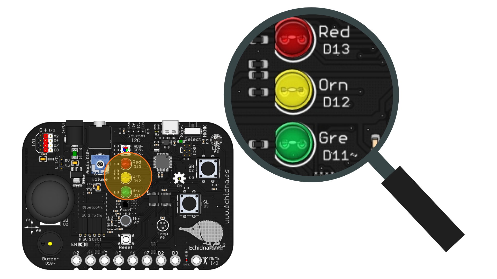
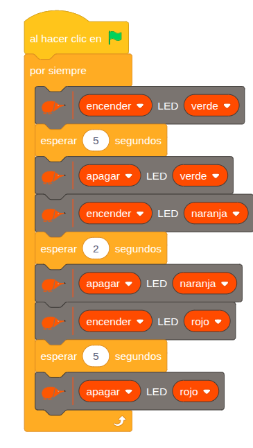
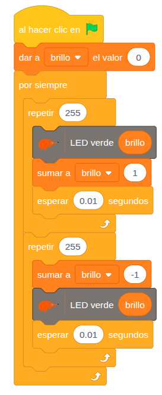

# 4.1.1 Ledes: Semáforo e intensidad luminosa

## COMPONENTE:

**Diodos LED**: es el acrónimo de Light Emitting Diode (Diodo emisor de luz), y está basado en el fenómeno de electroluminiscencia. Se usan como testigos (indicadores) y como fuente de iluminación.

En la **placa** tenemos 3 diodos LED Verde, Naranja y Rojo.

{ width="340" }

Los **LEDs Naranja y Rojo** pueden ser controlados únicamente de forma **digital** (estados de encendido/apagado). Por otro lado, el **LED Verde** puede ser controlado **digitalmente** y, además, permite el control de su intensidad luminosa (modulación analógica o **PWM**).

## BLOQUE DE PROGRAMACIÓN:

Para **controlar digitalmente** los LEDs podemos usar el siguiente bloque:

En el que podemos:

- Controlar el estado: encender o apagar
- Controlar qué LED queremos encender/apagar

  
Para **controlar la intensidad luminosa** del **LED Verde** podemos usar el siguiente bloque:

En el que podemos regular la intensidad luminosa entre 0 (apagado) y 255 (máxima intensidad luminosa)

## EJEMPLO: Semáforo

Este ejemplo muestra cómo programar un semáforo utilizando los LEDs de la placa. La programación se basa en una secuencia cíclica donde cada LED permanece encendido durante un tiempo específico y luego pasa al siguiente estado de forma automática.

**Estados**:

1.  El LED verde se enciende durante 5 segundos. Al finalizar este tiempo, se apaga.
2.  El LED naranja se enciende durante 2 segundos, y luego se apaga.
3.  El LED rojo se enciende durante 5 segundos. Transcurrido este tiempo, se apaga.

Luego, el ciclo vuelve a comenzar con la luz verde y se repite de forma indefinida.

## EJEMPLO: Control intensidad luminosa LED verde

Este ejemplo muestra cómo **controlar la intensidad luminosa del LED verde** para crear un **efecto** de "**fundido**" (fade) gradual, simulando un ciclo suave de encendido y apagado.

Para lograrlo, el programa utiliza dos bucles secuenciales que modifican progresivamente el valor de intensidad del LED (de 0 a 255):

**Bucle de encendido progresivo:**

El bucle controla la intensidad del LED aumentando su valor de forma gradual desde 0 (apagado) hasta 255 (máxima luminosidad). Este proceso se realiza en incrementos de una unidad, lo cual simula un efecto de fundido (fade) muy suave.

**Bucle de apagado progresivo:**

La intensidad del LED disminuye de 255 (máxima luminosidad) a 0, creando un efecto de fundido hasta apagarse por completo.  
Ambos bucles se ejecutan consecutivamente para generar el efecto de fundido suave y cíclico. Volviendo a repetirse al final del ciclo.
