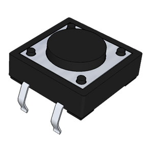
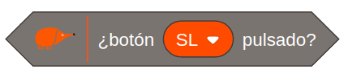
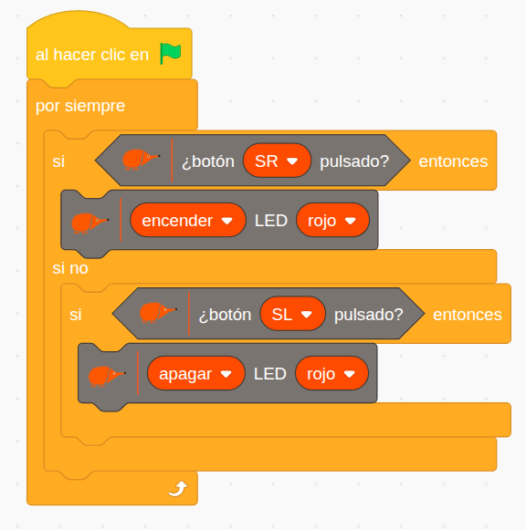
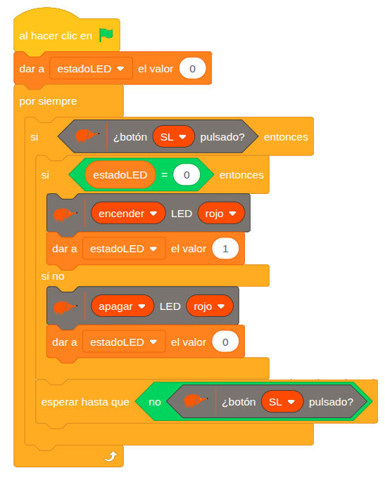

# 4.1.2 Pulsadores: Encender/Apagar Led

## COMPONENTE:

<div class="img-text-row" markdown="1">
{ width="200" }

El **pulsador** es un **componente** **electromecánico** que permite **abrir** o **cerrar** un **circuito** con un solo estado estable. La clave de su funcionamiento es que solo posee un estado estable o de reposo:
</div>

**Estado Estable** **Abierto** (Normalmente Abierto / NO): por defecto, el circuito está abierto (interrumpido) y solo se cierra mientras se mantiene presionado. Al soltarse, regresa inmediatamente a su estado abierto.

En la placa tenemos **2 pulsadores**, **SL** (Switch Left) y **SR** (Switch Right), situados en la parte derecha.

## BLOQUE DE PROGRAMACIÓN:

Para **leer** el **estado** del **pulsador** podemos usar el siguiente **bloque de programación**:

{ width="332" }

**Valor**: cuando leemos el estado del pulsador nos **devuelve** **true** (1) si está pulsado y **false** (0) si no está pulsado.

El bloque nos permite seleccionar el pulsador derecho SR o el izquierdo SL.

## EJEMPLO: Control encendido LED con dos pulsadores

Este ejemplo utiliza **dos pulsadores** para **controlar** el **encendido** y **apagado** del **LED** **rojo**. El pulsador **derecho** (SR) controla el **encendido** del LED rojo y el pulsador **izquierdo** (SL) el **apagado**.

{ width="576" }

**Lógica de programación:**

El programa comprueba continuamente:

```
SI el pulsador derecho (SR) está presionado:
    --> Enciende el LED Rojo inmediatamente.

SI NO (es decir, si SR no está presionado el programa comprueba la segunda condición):
    SI el pulsador izquierdo (SL) está presionado:
        --> Apaga el LED Rojo.
```

## EJEMPLO: Pulsador con memoria

Este ejemplo ilustra cómo **programar** un **pulsador** para que actúe como un **interruptor**. Es decir, la primera pulsación enciende un LED y la siguiente pulsación lo apaga.

Para que el sistema pueda "**recordar**" si el LED está actualmente encendido o apagado, utilizamos una **variable** de estado denominada ***estadoLED***. De esta forma, la variable estadoLED actúa como la memoria que permite al pulsador alternar entre los dos estados con cada activación.

{ width="547" }

**Lógica de programación:**

SI se pulsa el botón, el programa consulta el valor actual de la variable *estadoLED*:

   SI *estadoLED* indica APAGADO (valor 0), el programa:

      --\> Enciende el LED.

      --\> Cambia el valor de *estadoLED* a 1 (encendido).

   SI NO (si *estadoLED* indica ENCENDIDO valor 1):

      --\> Apaga el LED.

      --\> Cambia el valor de *estadoLED* a valor 0 (apagado).

Para asegurar que el cambio de estado (encendido → apagado, o viceversa) ocurra una única vez por cada pulsación, es crucial evitar que el programa registre múltiples activaciones mientras el botón se mantiene presionado.

Para ello, se añade un bloque "esperar hasta que" que mantiene la ejecución del programa en pausa hasta que el pulsador sea liberado. Esta técnica previene eficazmente el efecto de rebote y garantiza que la variable de estado se altere una sola vez por cada interacción física, logrando un control de memoria estable y predecible.
