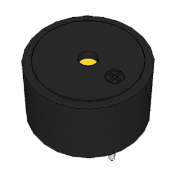
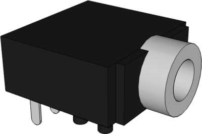
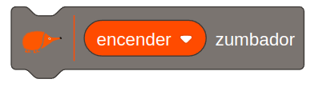
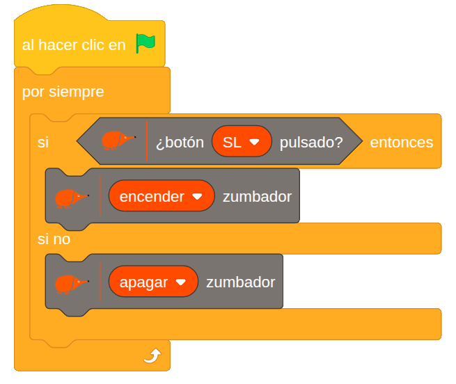

# 4.1.3 Zumbador: Pulsador-sonido

## COMPONENTE:

Disponemos de dos salidas para reproducir audio, el **zumbador** y el **jack** al que podemos conectar auriculares o altavoces autoamplificados. Al conectar una clavija de audio en el jack se desconecta el zumbador.

Además, contamos con un potenciómetro que permite ajustar el volumen del sonido.

## BLOQUE DE PROGRAMACIÓN:

Para controlar el **zumbador** podemos usar el siguiente **bloque**:

En el cual podemos cambiar su estado a encender o apagar.

## EJEMPLO: Timbre

Este ejemplo muestra cómo **controlar** el **zumbador** (actuador de sonido) utilizando un **pulsador** como **entrada**.

**Lógica de programación:**

SI el pulsador es presionado (o activado):

   ---\> El zumbador suena.

SI el pulsador es liberado (o soltado): 

   ---\> El zumbador deja de sonar

De esta forma, el zumbador solo se activa mientras el pulsador se mantiene presionado.
