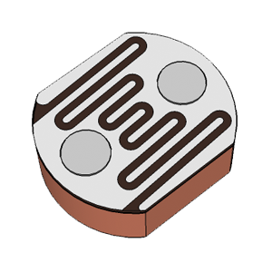
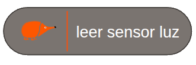
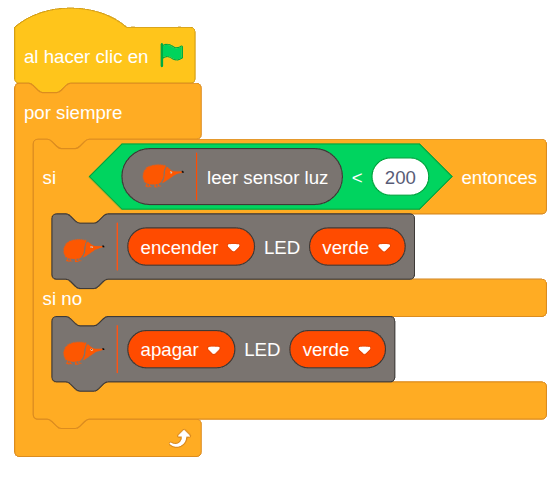

# 4.1.4 Sensor de Luz (LDR): Interruptor crepuscular

## COMPONENTE:

**LDR** es el acrónimo de “Light Dependent Resistor” (resistencia dependiente de la luz), es una **resistencia** cuyo **valor** depende de la **cantidad** de **luz** que incide sobre ella.

En la placa Echidnablack2 podemos encontrar la LDR en la esquina superior derecha.

## BLOQUE DE PROGRAMACIÓN:

Para **leer** el valor del **sensor** podemos usar el siguiente **bloque**:

Puedes activar la casilla de verificación para ver el valor registrado.

**Valores**: el sensor de luz proporciona valores bajos con poca luz y valores altos con mucha luz. Con una variabilidad entre 0 (no hay luz) y 1023 (mucha luz).

- 0 ausencia de luz
- 1023 mucha luz

## EJEMPLO: Interruptor crepuscular

Este ejemplo muestra como **controlar** automaticamente el **encendido** de un **LED** en función de la **intensidad** de la **luz** ambiental detectada por la LDR.

**Lógica de programación:**

El programa revisa continuamente:

SI el sensor de luz registra valores menores de 200:

   --\> Se enciende el LED verde.

SI NO (si registra valores mayores):

   --\> Se apaga el LED.

El valor 200 actúa como el umbral que define cuándo debe encenderse o apagarse la luz.
