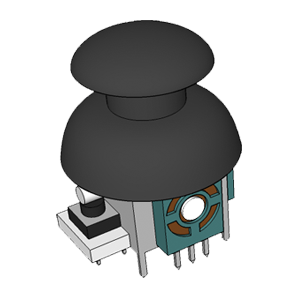
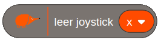
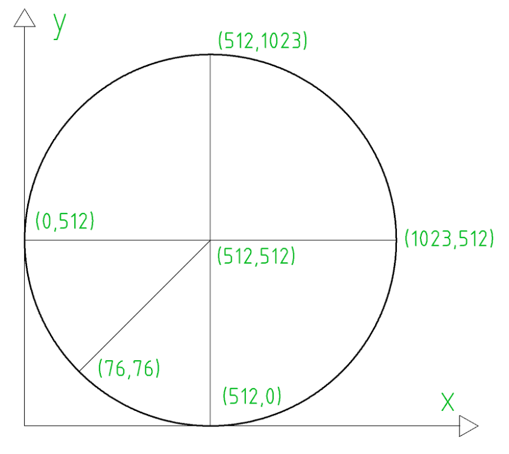
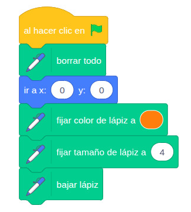
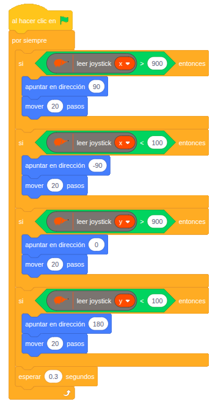

# 4.1.5 Joystick: Pintamos

## COMPONENTE:

Es un **dispositivo** de **entrada** con una palanca que se mueve en varias direcciones. Al inclinar la palanca, el joystick envía señales que indican hacia dónde y cuánto se ha desplazado respecto a dos ejes: horizontal (X) y vertical (Y).

Consta internamente de dos potenciómetros, uno para el eje X (movimiento horizontal) y otro para el eje Y (movimiento vertical), que convierten la posición del stick en valores de resistencia.

**Pulsador adicional:** este modelo incorpora además un pulsador (botón) que se activa al presionar el stick hacia abajo. En Echidnablack2, el pulsador del Joystick está conectado directamente con el pulsador "SR".

## BLOQUE DE PROGRAMACIÓN:

Para leer el valor del joystick podemos usar el siguiente bloque:

En el bloque podemos seleccionar eje x, o eje y

**Valores proporcionados por el joystick:**

- El joystick en reposo proporciona valores en torno a 512 en el eje x e y.
- En el eje x proporciona valor de 0 a la izquierda y valor 1023 a la derecha.
- En el eje y valor 0 abajo y 1023 arriba.

**Gráfica de valores del joystick:**

****

## EJEMPLO: Pintamos

Este ejemplo utiliza el Joystick (control de dos ejes) para controlar el movimiento de un puntero o lápiz virtual en la pantalla del entorno de programación.

**Cargar la herramienta lápiz:** Lo primero que tenemos que hacer es cargar la herramienta lápiz.

**Configuración inicial:** Configuramos la herramienta lápiz para que al inicio

- Borre el fondo.
- Se vaya al punto (0,0).
- Fijamos el color y el grosor con el que se va a pintar.
- Bajamos el lápiz.

**Lógica de programación de control del joystick:**

****

SI el joystick se desplaza a la derecha y registra valores mayores de 900 en el eje x:

   --\> El puntero se desplaza hacia la derecha.

SI el joystick se desplaza a la izquierda y registra valores menores de 100 en el eje x:

   --\> El puntero se desplaza hacia la izquierda.

SI el joystick se desplaza hacia arriba y registra valores mayores de 900 en el eje y:

   --\> El puntero se desplaza hacia arriba. 

SI el joystick se desplaza hacia abajo y registra valores menores de 100 en el eje y:

   --\> El puntero se desplaza hacia abajo.
