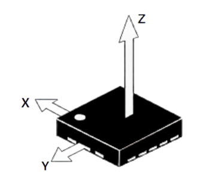
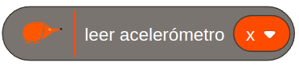
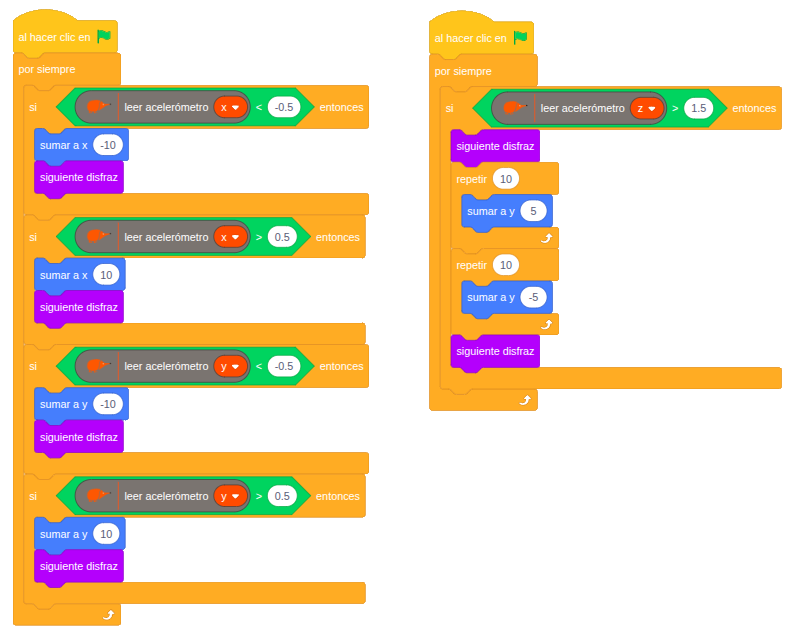

# 4.1.6 Acelerómetro: Movemos el echidna

## COMPONENTE:

<div class="img-text-row" markdown="1">
{ width="207" }

Es un **sensor** **microelectromecánico** (MEMS) de aceleración que **mide** los **movimientos** en los tres ejes: X, Y y Z.
</div>

**Mide la inclinación en los ejes X e Y: e**sto es posible porque la aceleración de la gravedad (1g) genera un cambio de capacitancia proporcional al ángulo de inclinación del sensor

**Permite detectar cambios bruscos o dinámicos de movimiento en el eje Z.: c**ualquier movimiento vertical repentino provoca una variación rápida en la aceleración medida a lo largo de este eje.

## BLOQUE DE PROGRAMACIÓN:

Para leer el valor del acelerómetro podemos usar el siguiente **bloque**:

{ width="297" }  
En el bloque **seleccionamos** eje x, eje y o eje z.

**Valores:**

- El acelerómetro en reposo proporciona valores en torno a 0 en los ejes x e y, y 1 en el eje z.
- En el eje x proporciona valor de 0 a -1 al elevar la parte derecha y de 0 a 1 al elevar la parte izquierda.
- En el eje y proporciona valor de 0 a -1 al elevar la parte trasera y de 0 a 1 al elevar la parte delantera.
- En el eje z se pueden registrar valores de menores de -2 al subir la placa rápidamente y de más de 2 al bajarla rápidamente.

## EJEMPLO: Movemos el echidna

Este programa permite que **movamos** el **personaje** en la **pantalla** mediante la **inclinación** de la **placa**.

Programamos la placa en dos hilos de ejecución:

{ width="794" }

**Hilo de control de movimiento:**

```
Si la placa se inclina a la izquierda y registra valores menores de -0,5 en el eje x:
    ➡ Entonces el personaje se desplaza hacia la izquierda.

Si la placa se inclina a la derecha y registra valores mayores de 0,5 en el eje x:
    ➡ Entonces el personaje se desplaza hacia la derecha.

Si la placa se inclina hacia atrás y registra valores menores de -0,5 en el eje y:
    ➡ Entonces el personaje se desplaza hacia abajo.

Si se inclina hacia delante y registra valores mayores de 0,5 en el eje y:
    ➡ Entonces el personaje se desplaza hacia arriba.
```

**Hilo de control de salto:**

```
Si se eleva bruscamente la placa y el eje z registra valores mayores de 1,5:
    ➡ Entonces el personaje efectúa un salto.
```
