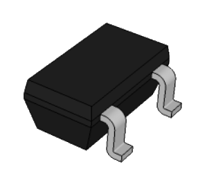
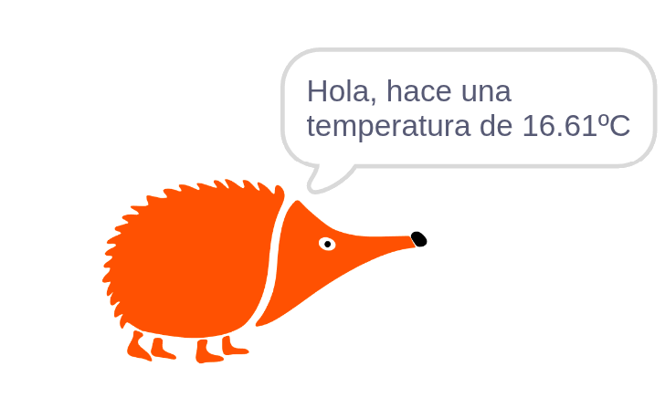

# 4.1.7 Sensor de temperatura: El erizo dice la temperatura

## COMPONENTE:

{ width="200" }

El MCP9700T es un sensor que entrega un voltaje analógico proporcional a la temperatura en grados Celsius (°C).

- **Sensibilidad**: cada 10 mV equivalen a 1°C.
- **Offset**: posee un voltaje de 500 mV (0.5V) a 0°C.

**Fórmula de Conversión:** la temperatura en grados Celsius se calcula como: T(°C)=(V −0.5)×100.

## BLOQUE DE PROGRAMACIÓN:

Para leer la temperatura podemos usar el siguiente **bloque**.

{ width="275" }

El bloque utiliza la fórmula de conversión anterior para convertir la tensión de lectura en voltios a °C.

Puedes activar la casilla de verificación para ver el valor registrado.

## EJEMPLO: El erizo dice la temperatura

En el ejemplo el erizo nos dice qué temperatura hace cuando pulsamos la letra "t" del teclado del ordenador.

{ width="400" }

{ width="895" }
