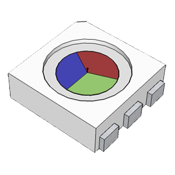
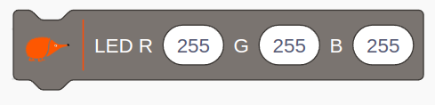
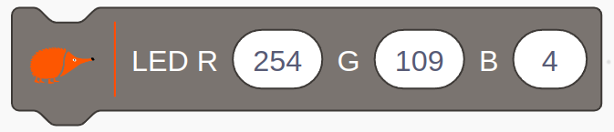
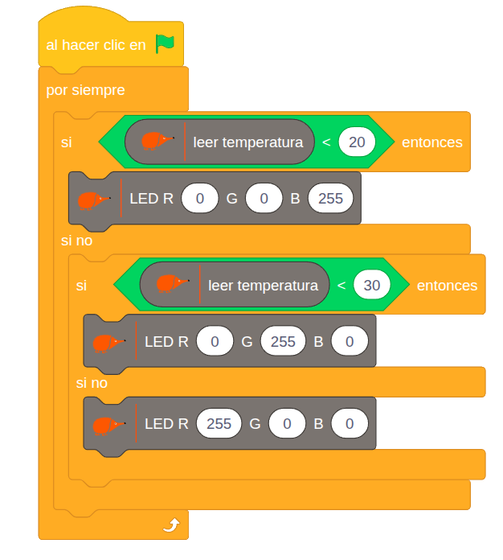
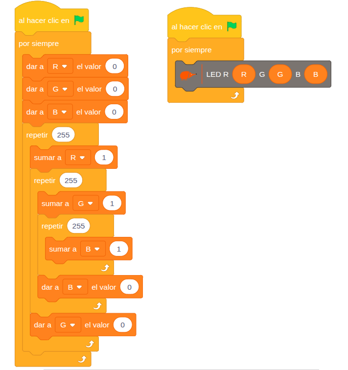

# 4.1.8 LED RGB: Mezclamos colores

## COMPONENTE:

{ width="200" }

El **LED RGB** es un único componente que **integra** **tres** **diodos** emisores de luz (LEDes) independientes **Rojo, Verde y Azul **dentro de la misma cápsula.

El acrónimo significa Light Emitting Diode (Diodo Emisor de Luz) y Red Green Blue (Rojo, Verde, Azul).

**Control de Luminosidad LED (PWM):** la luminosidad de cada uno de los tres LEDs se puede ajustar individualmente utilizando el control PWM (Modulación por Ancho de Pulso), a menudo denominado "analógico" en este contexto.

**Generación de Colores:** podemos controlar el brillo de cada color (R, G y B) variando su intensidad desde 0 (apagado) hasta 255 (máxima intensidad).

**Capacidad Cromática:** dado que cada canal ofrece 256 niveles de intensidad, la combinación de los tres colores (Rojo, Verde y Azul) permite generar un total de 256 x 256 x 256 = 16.777.216, más de 16 millones de colores diferentes.

## BLOQUE DE PROGRAMACIÓN:

Para controlar la luminosidad y el color del LED RGB tenemos el siguiente **bloque**:

{ width="311" }

En bloque podemos ajustar el valor de cada LED entre 0 y 255.

**Por ejemplo:** si queremos reproducir el naranja Echidna debemos establecer los siguientes valores:

{ width="348" }

## EJEMPLO: Indicador de Temperatura RGB

Este **ejemplo** utiliza el **sensor de temperatura** como dato de entrada para **controlar** el **color** del **LED RGB** (actuador). El **objetivo** es que el LED cambie de color automáticamente para indicar visualmente si la temperatura ambiente es baja (Azul), media (Verde) o alta (Rojo), funcionando como un termómetro visual.

El programa evalúa continuamente la temperatura ambiente y asigna un color específico según el umbral que se cumpla.

{ width="626" }

**Lógica de programación:**

**Zona Fría** (Alerta Azul):

```
SI la temperatura es inferior a 20°C:
    --> El LED RGB se ilumina en color azul.
```

**Zona Media** (Temperatura Óptima/Verde):

```
SI NO
    SI la temperatura es menor de 30ºC (está entre 20°C y 30°C):
        --> El LED RGB se ilumina en color verde.
```

**Zona Caliente** (Alerta Roja):

```
SI NO (es decir, si la temperatura supera los 30°C):
    --> El LED RGB se ilumina en color rojo.
```

## EJEMPLO: Recorremos los 16.7 millones de colores

Este programa utiliza tres bucles anidados de repetición para recorrer sistemáticamente la totalidad de las combinaciones de color. Al variar la intensidad de cada canal (Rojo, Verde y Azul) en sus 256 niveles posibles, el sistema es capaz de generar los más de 16.7 millones de colores únicos que componen el espectro RGB.

{ width="711" }

256×256×256≈16.7 millones de colores
