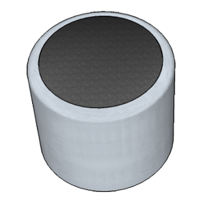
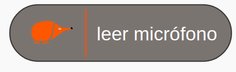
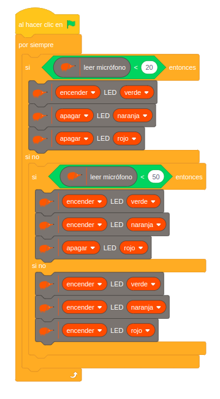
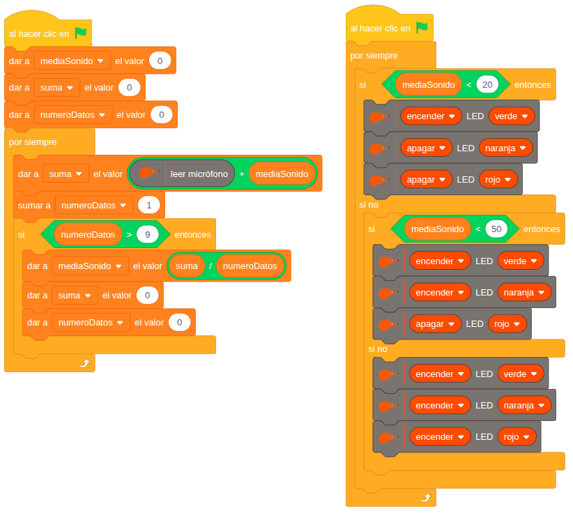

# 4.1.9 Micrófono: Vúmetro

## COMPONENTE:

Es un transductor acústico-eléctrico. Utiliza el efecto piezoeléctrico para convertir las vibraciones de sonido en una señal eléctrica.

**Principio de funcionamiento**: al recibir una onda sonora, el material piezoeléctrico genera una señal eléctrica que reproduce las mismas características (frecuencia y amplitud) del sonido captado.

**Variabilidad de la señal:** la señal eléctrica refleja directamente el sonido recibido, por lo que presenta una gran variabilidad. Se trata de una señal analógica compleja y que cambia constantemente, por lo que para poder trabajar adecuadamente con ella, se requiere un procesamiento posterior para su análisis (por ejemplo hallando la media aritmética), o, como alternativa, puede limitarse a detectar únicamente la intensidad del sonido.

## BLOQUE DE PROGRAMACIÓN:

Para leer el valor del sensor podemos usar el siguiente **bloque**:

Puedes activar la casilla de verificación para ver el valor registrado.

**Valores**: el micrófono proporciona valores bajos en presencia de poco sonido o silencio, y valores más altos cuando capta sonidos intensos. Con una variabilidad entre 0 (no hay sonido) y 1023 (sonido de alta intensidad).

## EJEMPLO: Vúmetro

Este ejemplo programa la placa para actuar como un semáforo de ruido o vúmetro, que indica visualmente la intensidad del sonido ambiente. El sistema opera según tres umbrales de sonido:

**Nivel Bajo:** si el sensor de sonido registra valores menores a 20 (ambiente silencioso), solo se enciende el LED verde.

**Nivel Medio:** si los valores están entre 20 y 50, se encienden los LEDs verde y naranja (precaución).

**Nivel Alto:** si el valor es superior a 50, se encienden los tres LEDs (alerta).

Es probable que, al ejecutar este código, se observe que el funcionamiento es inestable y los LEDs parpadean constantemente. Esto ocurre debido a la variabilidad de la señal de sonido.

Para solucionar esto mostramos el siguiente ejemplo.

## EJEMPLO: Vúmetro con media

Como hemos visto, la señal de sonido, se caracteriza por tener mucha variabilidad. Por ello, resulta conveniente aplicar un **tratamiento** o **filtrado** a la **señal**.

Una técnica efectiva para reducir esta variabilidad es el cálculo de la **media móvil** (o promedio). Esto implica tomar un número fijo de mediciones sucesivas y promediarlas.

**Cálculo de la media:** para implementar el cálculo de la media

1\. Creamos las siguientes variables:

1.  Variable suma para acumular los valores medidos en un ciclo.
2.  Variable numeroDatos para llevar la contabilidad del número de medidas.
3.  Variable mediaSonido para almacenar el valor de la media.

2\. Cada diez medidas (o el número de muestras predefinido):

1.  Calculamos el valor promedio (mediaSonido) dividiendo la suma entre el número de muestras.
2.  Inicializamos las variables suma y númeroDatos.

De esta forma, se suaviza la lectura y se obtienen valores más estables y representativos de la intensidad del sonido ambiente.
