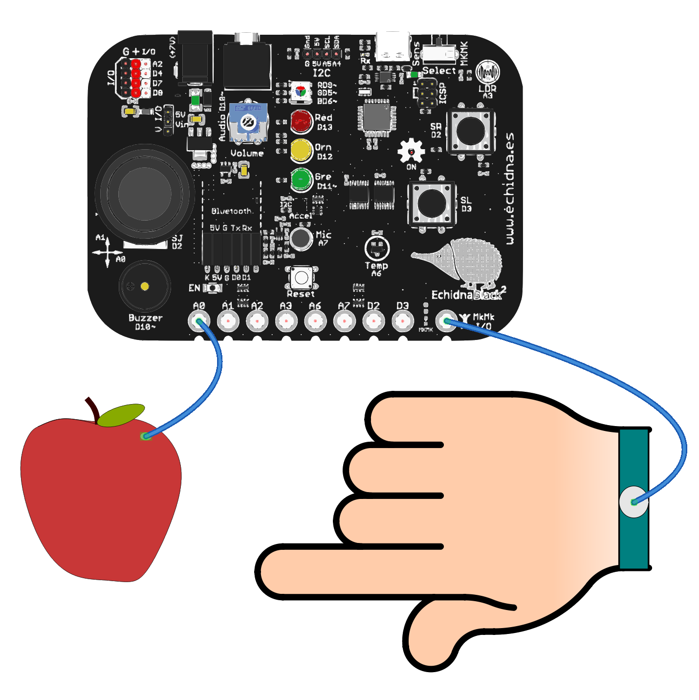
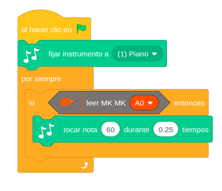
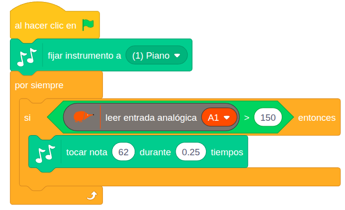

# 4.1.10 Entrada MKMk: Piano

## COMPONENTE:

¡RECUERDA! Para que funcione el modo MkMk debemos poner el selector del modo de funcionamiento hacia la derecha, y se nos encenderá el LED testigo en la parte inferior.

Echidna dispone de 8 conexiones MkMk.

Una conexión MkMk es un conector que permite detectar gran variedad de objetos al conectarlos entre una entrada y el común (El logo Echidna también se comporta como común).

Para detectar elementos debemos conectar un cable al común y otro a una de las entradas.

{ width="460" }

Entradas MkMk: A0, A1, A2, A3, A6, A7, D2, D3.

## BLOQUE DE PROGRAMACIÓN:

Echidna dispone de un bloque de programación específico para las entradas MkMk que nos devuelve un **true** o un **false** en función de si detecta que el **circuito** se ha **cerrado** o es un circuito **abierto**.

{ width="299" }

En el bloque podemos seleccionar la entrada MkMk que queramos utilizar.

**Valores**:

- Con el circuito abierto el sensor da valor **false** (0).
- Cuando cerramos el circuito, si el valor leido en la entrada analógica es mayor de 350, el valor reportado por el bloque es **true** (1).
- El **umbral** para cambiar de **false** a **true** está establecido en 350 dentro del rango de lecturas analógicas que puede registrar la entrada MKMK (0–1023).

Si queremos cambiar el valor del umbral podemos usar el bloque leer entrada analógica tal como se muestra en el segundo ejemplo: Ajustar sensibilidad.

## EJEMPLO: Piano

En este ejemplo vamos a ver cómo programar una nota de piano, que suena cuando tocamos la entrada MkMk A0.

En este caso sonará la nota 60 del piano durante 0,25 s cada vez que se activa la entrada MkMk A0.

{ width="456" }

## EJEMPLO: Ajustar la sensibilidad

Para ajustar el umbral de activación de las entradas analógicas del módulo MkMk, podemos utilizar el bloque "leer entrada analógica Ax".

En este caso el piano suena cuando el valor de la lectura es mayor de 150. 

{ width="697" }

Las entradas analógicas (A0, A1, A2, A3, A6, y A7) permiten definir un límite conductivo específico. Sin embargo, las entradas D2 y D3 son digitales. Por ello, solo detectan dos estados y no es posible realizar un ajuste del límite conductivo o umbral de activación.
