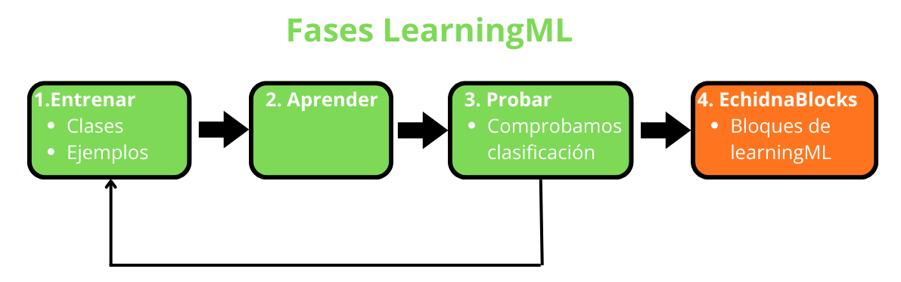
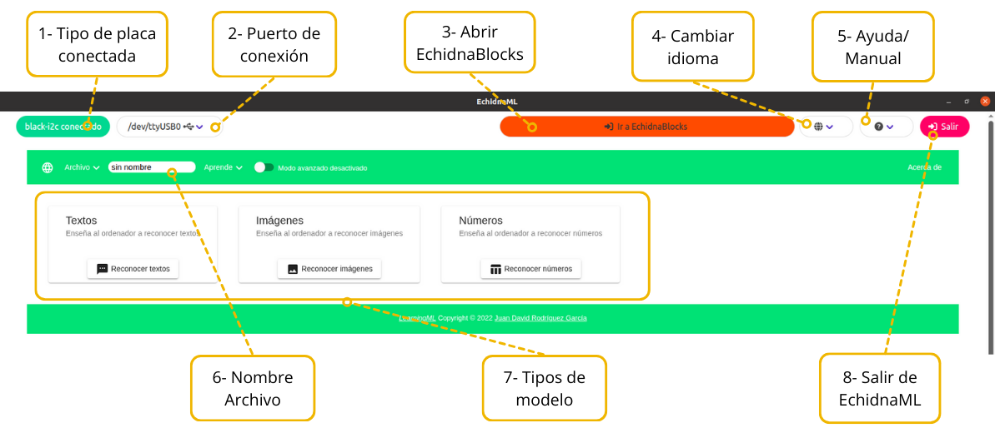

# 5.1 Introducción a LearningML

**LearningML** es una herramienta educativa diseñada para que el alumnado aprenda los conceptos básicos del **machine learning** de forma sencilla, visual y manipulativa. El alumnado puede crear modelos que clasifican **imágenes**, **textos** o **números** y después utilizarlos dentro de proyectos con bloques de Scratch.

Su principal **objetivo** es que el alumnado comprenda cómo se **entrenan** los **modelos**, qué **datos** necesitan, cómo influyen los **sesgos** y cómo se usan después para tomar **decisiones**. Todo ello sin programación compleja, favoreciendo el pensamiento computacional y el análisis crítico de la inteligencia artificial.

EchidnaML incluye esta herramienta, que puede usarse por sí misma o en combinación con los bloques de robótica con EchidnaBlocks.

#### Fases para crear un modelo LearningML

Para crear un modelo de machine learning tenemos que seguir los siguientes pasos.

1.  **Entrenar**: creamos las clases e introducimos los ejemplos.
2.  **Aprender**: creamos el modelo.
3.  **Probar**: comprobamos que el modelo clasifica correctamente.
    1.  Si no clasifica correctamente volvemos a la fase entrenar.
4.  Abrimos **EchidnaBlocks** y usamos los bloques de LearningML para construir nuestra aplicación.

#### Acceder a LearningML

Para acceder a LearningML lo podemos hacer a través del icono situado en la pantalla de EchidnaBlocks.

#### Entorno de LearningML

Al acceder a la pantalla de LearningML podemos:

1.  Ver si la placa está conectada y el modelo
2.  Ver puerto de conexión y reconectar si es necesario
3.  Abrir EchidnaBlocks.
4.  Cambiar el idioma.
5.  Acceder a la ayuda y el Manual
6.  Elegir el tipo de modelo que queremos crear: texto, imagen o números.
7.  Elegir Nombre del archivo
8.  Salir del programa.

Una vez seleccionado el tipo de modelo textos, imágenes ó números, iniciamos su construcción. A continuación, encontrará instrucciones para crear modelos de reconocimiento de **textos**, **imágenes** y **números**.

Para ampliar la información sobre su uso, puede consultar la web del proyecto [web.learningml.org](https://web.learningml.org/).
