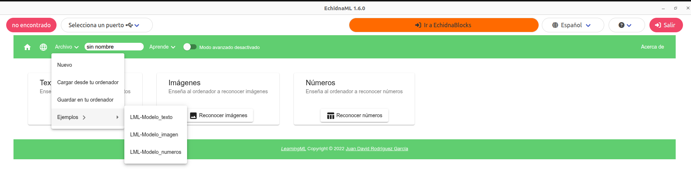

# 5.2.1 Menú Archivo

En el **menú** **Archivo** de **LearningML** encontramos:

- Nuevo
- Cargar desde tu ordenador
- Guardar en tu ordenador
- Ejemplos

{ width="998" }

#### Nuevo

Si quieres empezar un nuevo modelo.

#### Guardar en tu ordenador

La versión de **LearningML** en EchidnaML es un programa de **escritorio**, por lo que si quieres **guardar** los **datos** de **entrenamiento** de los modelos debes **descargarlos** y **almacenarlos** en tu **ordenador**. Para ello debes pulsar en Archivo → Guardar en tu ordenador y almacenarlo en la carpeta que elijas.

#### Cargar desde tu ordenador

Para recuperar el proyecto, pulsa en Archivo → Cargar desde tu ordenador y busca el archivo en la carpeta donde lo almacenaste.

Los datos de entrenamiento de los modelos se almacenan en **formato** **json** y son compatibles con los realizados en LearningML escritorio y online. Una vez cargado un archivo json en LearningML será necesario hacer clic en el botón Aprender para poder usar el modelo.

#### Ejemplos

En este submenú puedes encontrar los **modelos** de **ejemplo** que desarrollamos en el apartado [5.3 Creación de modelos](../03-modelos/index.md):

- LML-Modelo_texto: [5.3.1 Modelo de texto](../03-modelos/01-modelo-texto.md)
- LML-Modelo_imagen: [5.3.2 Modelo de imágenes](../03-modelos/02-modelo-imagenes.md)
- LML-Modelo_numeros: [5.3.3 Modelo de números](../03-modelos/03-modelo-numeros.md)

En Echidna creemos que una de las mejores formas de **aprender** es a partir de **ejemplos**, por lo que os facilitamos estos modelos para que podáis probarlos, estudiarlos y modificarlos.
