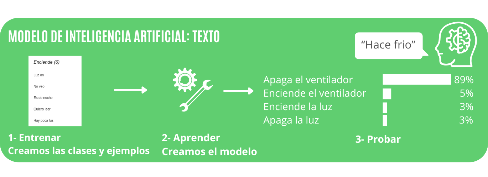
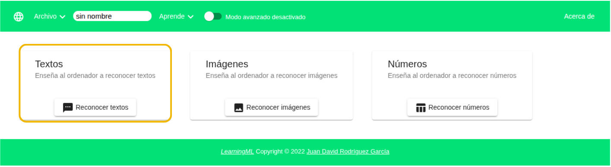
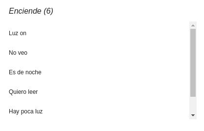
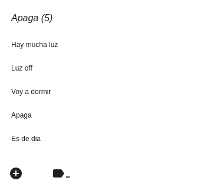
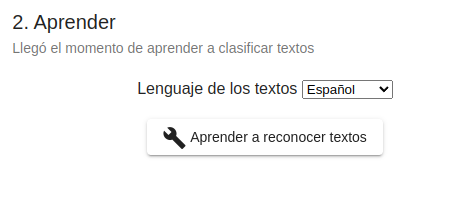
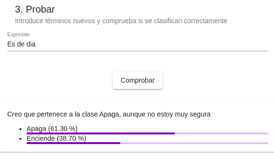
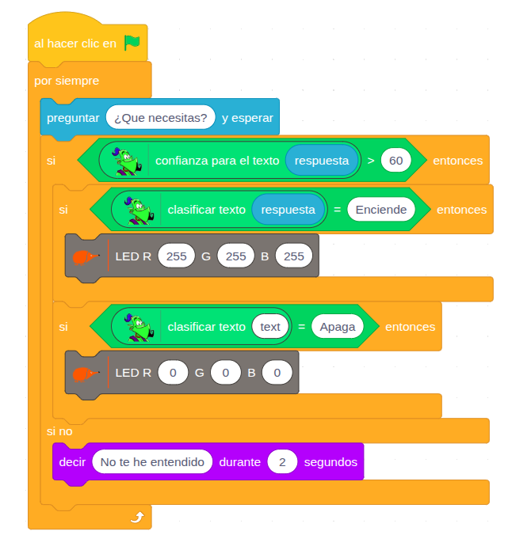

# 5.2 Modelo de texto

Vamos a ver los pasos para crear un **modelo** de **texto** en **LearningML** y como **usarlo** con **EchidnaBlocks**.

En este caso crearemos un **asistente virtual** que controla la iluminación de una vivienda y el ventilador.

{ width="1000" }

## Abrir LearningML

Una vez hemos abierto EchidnaML abrimos la aplicación: Modelos de Machine Learning.

## Elegir tipo de datos

Lo primero que tenemos que hacer es **elegir** con qué **tipo** de **datos** vamos a trabajar: podemos hacerlo con textos, imágenes y números. En nuestro caso vamos a trabajar con datos de tipo **texto**.

{ width="999" }

## 1- Entrenar: Crear las clases y añadir los ejemplos

Una vez elegido el tipo de datos (en este caso, texto), procedemos a la **creación** de las **clases** y a la **introducción** de los **datos** (ejemplos de texto) que el algoritmo usará para aprender a clasificarlos.

En nuestro caso, vamos a crear dos clases para controlar el LED: Enciende y Apaga.

**Clase "Enciende":** Introduciremos órdenes y frases que indiquen al sistema la intención de encender la luz (p. ej., "luz on", "enciende el LED", "enciende").

**Clase "Apaga":** Introduciremos órdenes que indiquen la intención de apagar la luz (p. ej., "apagar", "luz off", "corta la luz").

{ width="389" }

{ width="302" }

La **calidad** del **modelo** construido está directamente ligada a los datos de entrenamiento. Cuantos más textos, y mejor elegidos, se añadan a cada clase, mayor será la precisión del modelo al clasificar nuevos textos.

## 2- Aprender

Una vez que hemos definido las clases e introducido los ejemplos de entrenamiento, se procede a pulsar el botón **Aprender a reconocer textos**.

{ width="201" }

En ese momento, el algoritmo de Machine Learning analiza los datos proporcionados para construir un **modelo** de **Inteligencia** **Artificial**. Este modelo resultante es capaz de clasificar y reconocer nuevos textos que no ha visto antes.

Este proceso se denomina **aprendizaje a partir de datos** y constituye el fundamento esencial del Machine Learning.

## 3- Probar

Una vez construido el modelo, debemos realizar **pruebas** para **comprobar** si el modelo **clasifica** **correctamente** y con que % de confianza lo hace.

Para esta fase de verificación, es crucial **utilizar** **textos** que sean **distintos** a los ejemplos que se introdujeron durante el proceso de entrenamiento. Esto garantiza que estamos probando la capacidad de generalización del modelo, y no simplemente su "memoria".

{ width="401" }

En este caso comprobamos que clasifica la frase “Es de día” con un 61% de probabilidad en la categoría Apaga. Lo cual es correcto.

## 1- ¿Volver a entrenar?

Si los resultados de la prueba no son satisfactorios o si se desea incrementar la precisión del modelo, es necesario entrar en una fase de iteración y mejora.

**Revisión**: Examina y corrige los datos introducidos en los ejemplos.

**Ampliación**: Añada más ejemplos de entrenamiento.

La **calidad** del **modelo** está directamente relacionada con la **cantidad** y la **calidad** de los **datos** de **entrenamiento**. Cuantos más datos de calidad se utilicen, siempre y cuando estén correctamente etiquetados, mayor será la precisión y la calidad de las clasificaciones futuras del modelo

## 4- Programamos en EchidnaBlocks

Una vez que las pruebas de entrenamiento hayan sido satisfactorias, abrimos **EchidnaBlocks**. 

A continuación, la aplicación se programará combinando los bloques de Scratch, con los bloques de robótica y los de Machine Learning (learningml), utilizando el modelo que acabamos de generar.

Este **ejemplo** muestra cómo **usar** el **modelo** de Machine Learning que hemos creado para **clasificar** una **entrada** de **texto** y, con el resultado, tomar una **decisión** en la placa robótica: **encender** o **apagar** el **LED** **RGB**.

{ width="646" }

**Consulta**: El personaje pregunta qué necesitamos y envía la respuesta que introduce el usuario al modelo de machine learning para su clasificación.

**Verificación de Confianza:** El sistema comprueba el índice de confianza que el modelo asigna a su clasificación. La acción sólo se ejecuta SI este índice es superior al 60%. En caso de que la Confianza sea menor del 60% el programa dice “No te he entendido”.

**Clasificación**: Si la confianza es suficiente, el sistema determina la clase:

```
SI la clase es "Enciende":
    --> El programa envía la instrucción para encender el LED.

SI la clase es "Apaga":
    --> El programa envía la instrucción para apagar el LED.
```

Al finalizar, el personaje vuelve a decir: “¿Qué necesitas?”, indicando que está listo para una nueva clasificación.
