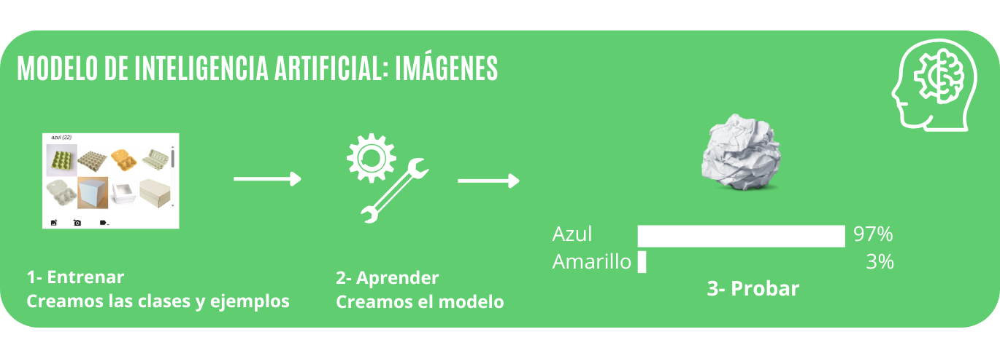
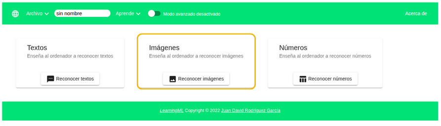
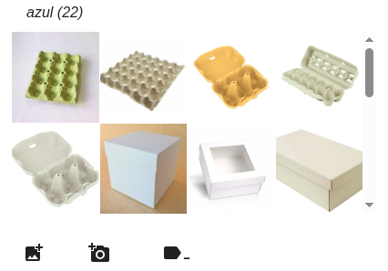
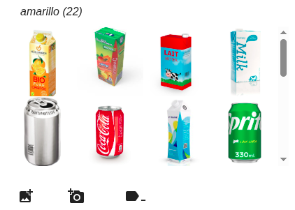
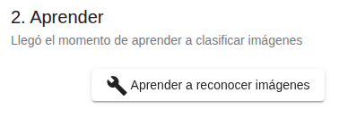
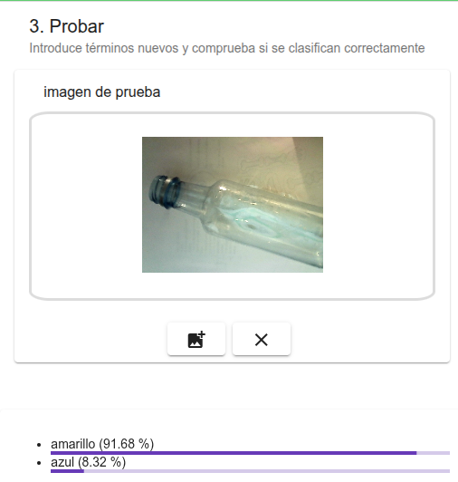
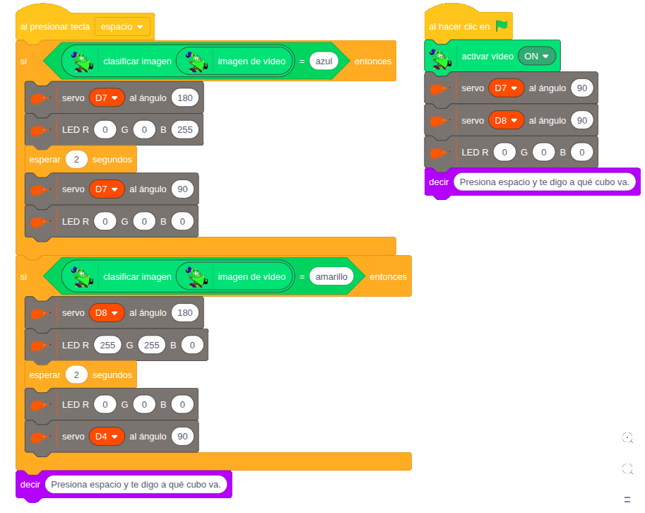

# 5.3 Modelo de imágenes

En este segundo ejemplo con **LearningML** veremos los pasos para crear un **modelo** de **imagenes** y cómo usarlo con **EchidnaBlocks**.

Vamos a crear un modelo que nos clasifique los envases y papeles en las categorías amarillo y azul. En EchidnaBlocks vamos a mostrar la clasificación mediante un LED RGB y vamos a abrir el contenedor con un servomotor.

{ width="1000" }

## Abrir LearningML

Una vez hemos abierto EchidnaML abrimos la aplicación: Modelos de Machine Learning.

## Elegir tipo de datos

Es el momento de elegir con qué tipo de datos vamos a trabajar, en este caso trabajaremos con datos de imágenes.

{ width="798" }

## 1- Entrenar: Crear las clases y añadir los ejemplos

Una vez hemos elegido el tipo de datos creamos las clases y le proporcionamos datos para que el algoritmo aprenda a reconocerlas.

Creamos dos clases: **azul** y **amarillo**, que nos permitirá reconocer residuos que se reciclan en el contenedor amarillo y residuos que se reciclan en el contenedor azul, para controlar dos servomotores que abran el contenedor adecuado.

{ width="400" }

{ width="400" }

## 2- Aprender

{ width="200" }

Pulsamos el botón **2. Aprender a reconocer imágenes**, para que el algoritmo de machine learning analice las imágenes y construya un modelo de Inteligencia Artificial capaz de reconocer imágenes similares pero distintas a las que hemos usado durante el entrenamiento.

La construcción del modelo, que se denomina aprendizaje, puede tardar varios segundos. Si las imágenes de ejemplo de la fase de entrenamiento son muchas, este proceso puede tardar bastante. Esto es una característica de los algoritmos de machine learning, requieren mucho tiempo de proceso y bastante memoria.

## 3- Probar

Cuando el algoritmo finaliza ya tenemos disponible el modelo de Machine Learning. Es el momento de probar su funcionamiento.

Añadimos imágenes nuevas, no usadas en el entrenamiento y hacemos pruebas para comprobar si el modelo clasifica correctamente y con qué porcentaje de confianza lo hace.

{ width="300" }

En el ejemplo que mostramos, comprobamos que clasifica la imagen con más de un 91% de probabilidad en la categoría amarillo, lo cual refleja un alto grado de confianza en la respuesta dada.

## 1- ¿Volver a entrenar?

Si el modelo no clasifica como queremos o deseamos mejorarlo hay que añadir y revisar los datos de la fase de entrenamiento.

## 4- Programamos en EchidnaBlocks

Una vez que las pruebas de entrenamiento hayan sido satisfactorias, podemos acceder a **EchidnaBlocks**. Desde donde ya podremos utilizar los bloques de machine learning con el modelo que acabamos de generar y programar nuestra aplicación robótica.

Este ejemplo implementa un sistema automatizado que utiliza un modelo de machine learning para **clasificar** una **imagen** capturada por la **cámara** y, en función del resultado, **activa** los **actuadores** del robot (servos y LED RGB).

{ width="913" }

**Configuración Inicial:**

Al inicio del programa, el sistema se prepara para recibir la clasificación:

- Se activa la cámara para la captura de vídeo.
- Los servos D7 y D8 se colocan en la posición de 90° (posición de cerrado o reposo).
- El LED RGB se asegura de estar apagado.

**El personaje indica: **

"Presiona espacio y te digo a qué cubo va", señalando que el sistema está listo para clasificar.

**Lógica de Clasificación:**

Al presionar la tecla Espacio, el programa clasifica el fotograma de vídeo capturado y ejecuta la acción robótica correspondiente:

```
SI clasifica en clase "azul":
    --> El servo D7 se mueve a 0° (abre el cubo azul).
    --> El LED se ilumina en color azul (RGB 0, 0, 255).

SI clasifica en clase "amarilla":
    --> El servo D8 se mueve a 0° (abre el cubo amarillo).
    --> El LED se ilumina en color amarillo (RGB 255, 255, 0).
```

Al finalizar, el personaje vuelve a decir: “Presiona espacio y te digo a qué cubo va”, indicando que está listo para una nueva clasificación.
