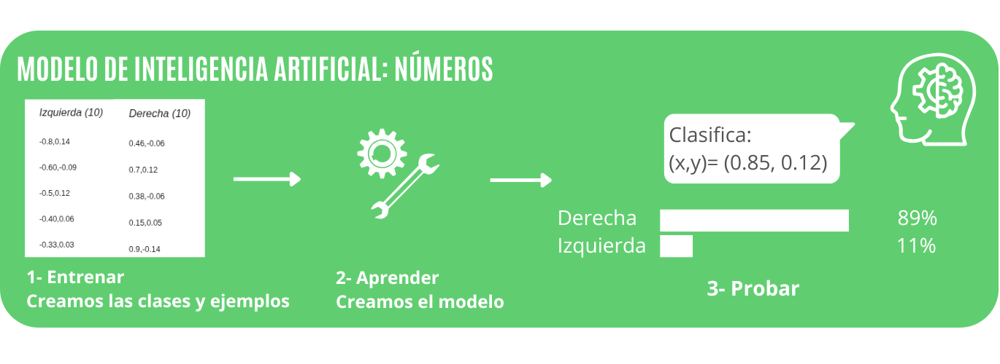
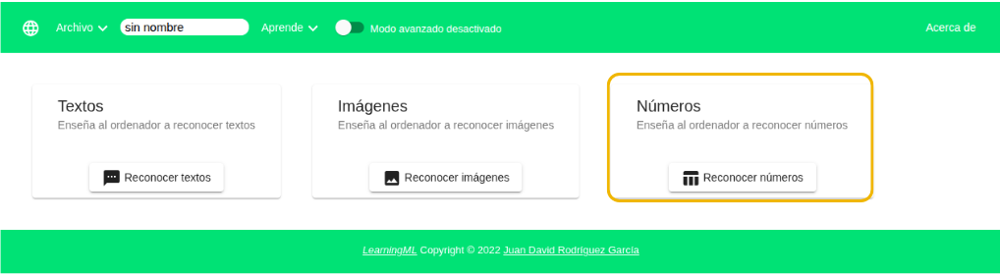
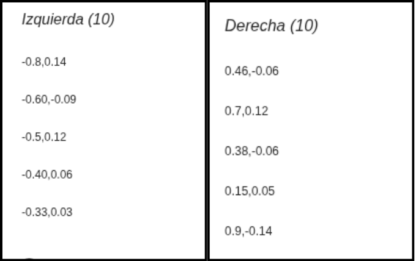
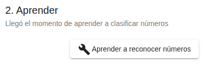
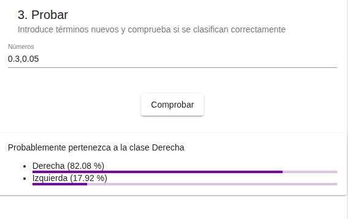
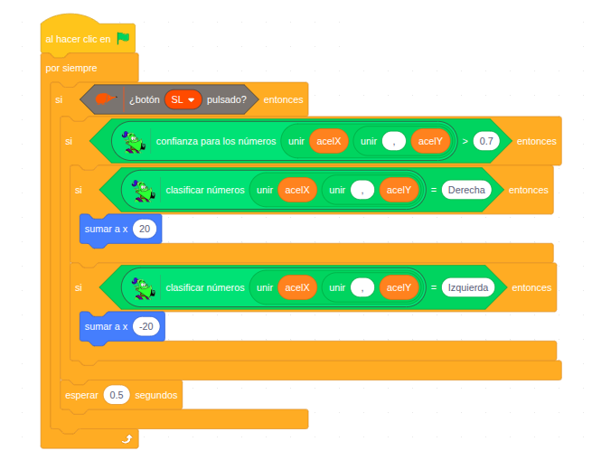

# 5.4 Modelo de números

En este tercer ejemplo con **LearningML** veremos los pasos para crear un **modelo** de **números** y cómo usarlo con **EchidnaBlocks**.

En este caso vamos a crear un modelo que nos **clasifique** la **inclinación** de la **placa** detectando: **derecha** e **izquierda**. En EchidnaBlocks vamos a desplazar el personaje en la dirección que nos clasifique.

{ width="1000" }

## Abrir LearningML

Una vez hemos abierto EchidnaML abrimos la aplicación: Modelos de Machine Learning.

## Elegir tipo de datos

Es el momento de elegir con qué **tipo** de **datos** vamos a trabajar, en este caso con datos de tipo **números**.

{ width="1018" }

## 1- Entrenar: Crear las clases y añadir los ejemplos

Una vez hemos elegido el tipo de **datos números**, seleccionamos el número de columnas del dato a introducir. En nuestro caso elegimos números con 2 columnas, ya que vamos a introducir datos de los valores del acelerómetro en coordenadas x e y.

Creamos las clases y le proporcionamos datos para que el algoritmo aprenda a reconocerlas.

En este caso vamos a crear dos **clases**:

- **Derecha**
- **Izquierda**

Los números se deben introducir separándolos con una coma. Como hemos elegido un número de columnas igual a 2, debemos introducir un par de números separados por una coma.

{ width="680" }

## 2- Aprender

Al hacer clic en el botón **Aprender a reconocer números**, como ya hemos visto en los otros tipos, el algoritmo de machine learning aprende a reconocer números a partir de nuestros datos.

{ width="411" }

## 3- Probar

Es el momento de **probar** que el **modelo** que hemos creado **clasifica** **correctamente**. Para lo cual introducimos en la caja de texto de la fase 3-Probar, nuevos números separados por coma, similares pero distintos a los de la fase de entrenamiento.

El modelo arrojará su predicción y comprobaremos si clasifica correctamente y con qué porcentaje de confianza lo hace.

En este caso comprobamos que clasifica números de diferentes sectores con más de un 80% de probabilidad en la categoría que le corresponde.

{ width="579" }

## 1- ¿Volver a entrenar?

Si no clasifica como queremos, tendremos que añadir y revisar los datos de la fase de entrenamiento.

## 4- Programamos en EchidnaBlocks

Una vez que las pruebas del modelo hayan sido satisfactorias, podemos acceder a **EchidnaBlocks**. Desde allí, ya podremos utilizar los **bloques** de **learningml** con el modelo que acabamos de generar y programar nuestra aplicación robótica.

En este ejemplo, cuando **presionamos** el botón **SL**, el programa **clasifica** la **inclinación** de la **placa** a partir de los **valores** del **acelerómetro**.

{ width="655" }

**Lógica de programación:**

```
Si la clasifica como "derecha":
    ➡ Entonces el personaje se desplaza a la derecha.

Si la clasifica como "izquierda":
    ➡ Entonces el personaje se desplaza a la izquierda.
```
