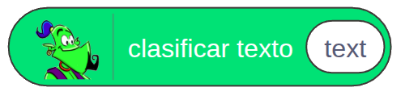
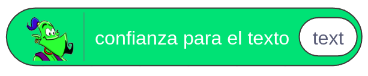
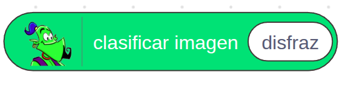
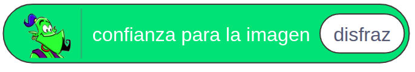
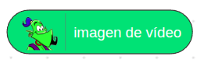
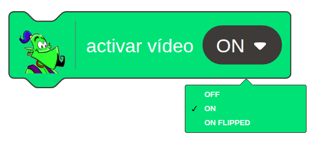
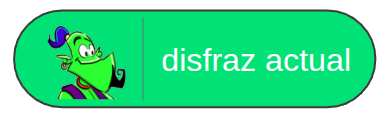
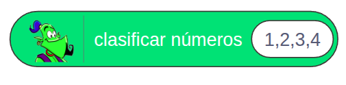
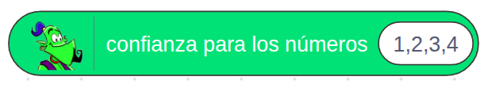

# 5.5 Bloques LearningML en EchidnaBlocks

**EchidnaBlocks** cuenta con los siguientes **bloques** para usar los modelos de machine learning creados en **LearningML**.

<table style="width: 100%; height: 286px;" data-border="0">
<colgroup>
<col style="width: 50%" />
<col style="width: 50%" />
</colgroup>
<tbody>
<tr class="odd" style="height: 79px;">
<td style="width: 24.4422%; height: 79px"></td>
<td style="width: 75.5578%; height: 79px"><strong>Clasifica texto:</strong> devuelve la etiqueta clasificada como más probable del texto que se introduzca como argumento.</td>
</tr>
<tr class="even" style="height: 23px;">
<td style="width: 24.4422%; height: 23px"></td>
<td style="width: 75.5578%; height: 23px"><strong>Confianza para texto:</strong> devuelve la probabilidad en porcentaje (0-100) de la clasificación propuesta por el modelo.</td>
</tr>
<tr class="odd" style="height: 23px;">
<td style="width: 24.4422%; height: 23px"></td>
<td style="width: 75.5578%; height: 23px"><strong>Clasificar imagen:</strong> devuelve el valor de la clasificación dada por el modelo de Machine Learning a la imagen que se aporta como primer argumento. Dicho argumento puede ser: 
&#10;<ul>
<li>El nº de disfraz cuya imagen se quiere clasificar</li>
<li>El disfraz actual dado por el reporter “disfraz actual”</li>
<li>La imagen tomada por la webcam y representada por el reporter</li>
</ul></td>
</tr>
<tr class="even" style="height: 23px;">
<td style="width: 24.4422%; height: 23px"></td>
<td style="width: 75.5578%; height: 23px">
<strong>Confianza para la imagen:</strong> devuelve la probabilidad asignada por el modelo a la clasificación más probable (es decir a la que devuelve el reporter anterior) de la imagen que se aporta en su argumento, que igual que antes puede ser: 

<ul>
<li>El nº de disfraz cuya imagen se quiere clasificar</li>
<li>El disfraz actual dado por el reporter</li>
<li>La imagen tomada por la webcam y representada por el reporter</li>
</ul></td>
</tr>
<tr class="odd" style="height: 23px;">
<td style="width: 24.4422%; height: 23px"></td>
<td style="width: 75.5578%; height: 23px"><strong>Imagen de vídeo:</strong> devuelve la imagen tomada por la webcam.</td>
</tr>
<tr class="even" style="height: 23px;">
<td style="width: 24.4422%; height: 23px"></td>
<td style="width: 75.5578%; height: 23px"><strong>Activar vídeo:</strong> Un comando con el que se puede activar la webcam, activar la webcam en modo invertido desactivar la webcam.</td>
</tr>
<tr class="odd" style="height: 23px;">
<td style="width: 24.4422%; height: 23px"></td>
<td style="width: 75.5578%; height: 23px"><strong>Disfraz actual:</strong> devuelve el disfraz actual activo.</td>
</tr>
<tr class="even">
<td style="width: 24.4422%"></td>
<td style="width: 75.5578%"><strong>Clasificar números:</strong> es un bloque que devuelve la etiqueta clasificada como más probable del conjunto de números que se introduzca como argumento.</td>
</tr>
<tr class="odd">
<td style="width: 24.4422%"></td>
<td style="width: 75.5578%"><strong>Confianza para los números:</strong> devuelve la probabilidad en % (0-100) de la clasificación propuesta por el modelo.</td>
</tr>
</tbody>
</table>
