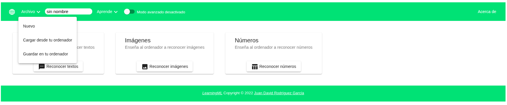

# 5.6 Exportar e importar datos de entrenamiento

La versión de **LearningML** en EchidnaML es un programa de **Escritorio**, por lo que si quieres **guardar** los **datos** de **entrenamiento** de los modelos debes **descargarlos** y **almacenarlos** en tu **ordenador**. Para ello debes pulsar en Archivo→ Guardar en tu ordenador y almacenarlo en la carpeta que elijas.

Para recuperar el proyecto debes pulsar en Archivo→ Cargar desde tu ordenador y buscar el archivo en la carpeta donde lo almacenaste.

Los datos de entrenamiento de los modelos se almacenan en **formato** **json** y son compatibles con los realizados en LearningML escritorio y online. Una vez cargado un archivo json en LearningML será necesario hacer clic en el botón Aprender para poder usar el modelo.
