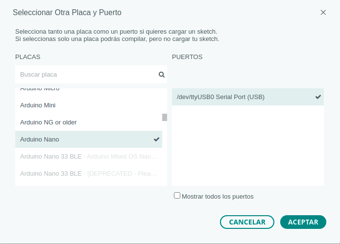

# 6.2 Cómo instalar StandardFirmata

Vamos a ver cómo instalar StandardFirmata usando el **IDE de Arduino**, para lo cual debes seguir los siguientes pasos:

**1- Instalar IDE Arduino:**

El primer paso será tener instalado en nuestro ordenador el [IDE de Arduino](https://www.arduino.cc/en/software/). Está disponible para Linux, MacOs y Windows y te lo puedes descargar desde la propia página de Arduino, donde también tienes una guía para instalarlo.

**2- Conectamos la placa EchidnaBlack** a nuestro ordenador a través del puerto USB.

**3- Abrimos el IDE de Arduino**.

**4- Seleccionamos la placa Arduino** que estemos usando y el **puerto USB** al que se conecta.

{ width="400" }

**Placa Arduino:** si tu placa es EchidnaBlack o EchidnaBlack2, debes escoger Arduino **Nano**.

En Herramientas → Placa→ Arduino Nano.

**Puerto USB:** tenemos que seleccionar el puerto USB al que se conecta la placa.

Seguramente aparezca una indicación del puerto USB al que está conectado tu Echidna.

En función del sistema operativo que tengas te aparecerá un nombre para el puerto:

- GNU Linux: /dev/ttyUSB0
- Windows: COM21
- MACOS: /dev/cu.usbserial-1410 port (USB)

En el que el número asignado puede variar en función de los dispositivos que tengamos conectados.

**5- Seleccionamos el programa que vamos a cargar, es decir el StandardFirmata.**

Lo hacemos desde el menú Archivo → Ejemplos→ Firmata→ StandardFirmata. 

Atención si no hemos seleccionado la placa en el paso anterior no nos aparecen los programas Firmata.

**6- Cargamos el programa en la placa.** 

Para ello clica en el botón “Subir”, que indica al IDE Arduino que cargue el programa en la placa. 

Una vez cargado tu Echidna ya está lista para ser programada con EchidnaML. Aunque desconectes la placa y la guardes, el programa StandardFirmata seguirá instalado en la placa. Cuando la vuelvas a conectar a la computadora, se ejecutará dicho programa y será capaz de comunicarse con EchidnaML. Así que la carga del programa StandardFirmata solo la tendrás que hacer una vez.

## ¿Qué otros programas puedo usar?

Hemos explicado cómo usar el IDE de Arduino, pero también puedes usar otros programas como:

- [PlatformIO](https://platformio.org/install)
- [Eclipse Arduino IDE](https://www.eclipse.org/community/eclipse_newsletter/2017/april/article4.php)
- [Codebender](https://codebender.cc/)
- [ArduinoDroid](https://play.google.com/store/apps/details?id=name.antonsmirnov.android.arduinodroid2&hl=es&gl=US)
- [Programino](https://programino.com/download-programino-ide-for-arduino.html)

Con
