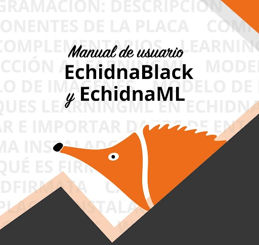

# MANUAL ECHIDNABLACK Y ECHIDNAML {: .visually-hidden }

{ width="380" }

Manual completo de la placa educativa **EchidnaBlack2** y del entorno de programación **EchidnaML**, pensado para docentes y alumnado de Primaria, Secundaria, Bachillerato y F.P.

[Descargar el manual en PDF](manual.pdf){ .md-button .md-button--primary }
