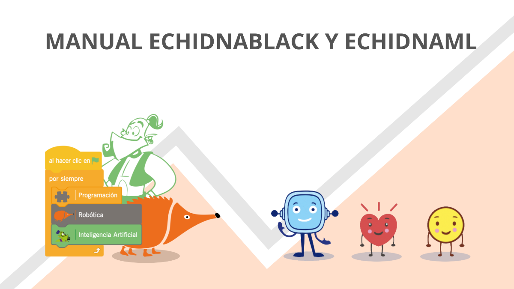

# MANUAL ECHIDNABLACK Y ECHIDNAML {: .visually-hidden }

{ width="1200" }

Manual completo de la placa educativa **EchidnaBlack2** y del entorno de programación **EchidnaML**, pensado para docentes y alumnado de Primaria, Secundaria, Bachillerato y F.P.

[Descargar el manual en PDF](manual.pdf){ .md-button .md-button--primary }

### Empieza aquí

Instala EchidnaML y da tus primeros pasos con la placa EchidnaBlack.

[Ir a instalación →](08-instalacion-echidnaml/index.md)

### Componentes y bloques

Descubre los sensores y actuadores de la placa y cómo programarlos.

[Ver componentes →](04-componentes-bloques/index.md)

### Preguntas frecuentes

Resuelve las dudas más habituales al instalar o usar el sistema.

[Ver preguntas frecuentes →](09-preguntas-frecuentes.md)

